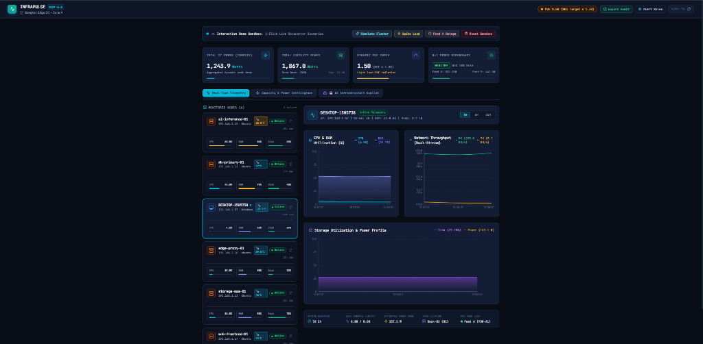
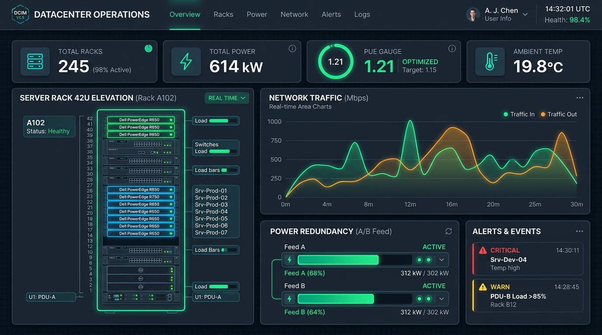
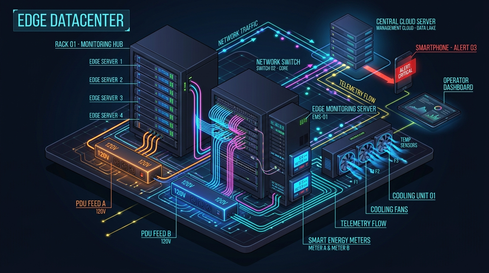
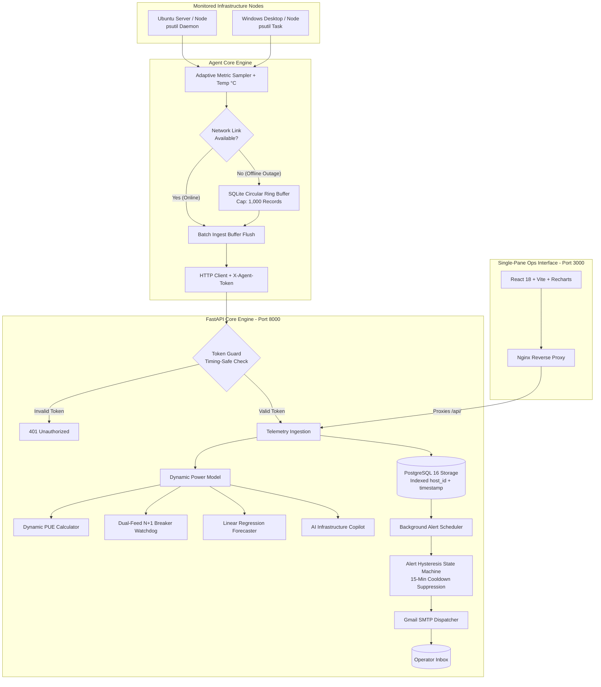
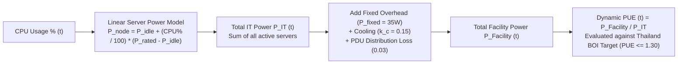

# ⚡ InfraPulse — Mini Data Center Infrastructure & Capacity Monitoring System

[](https://fastapi.tiangolo.com)
[](https://react.dev/)
[](https://www.typescriptlang.org/)
[](https://www.postgresql.org/)
[](https://tailwindcss.com/)
[](https://recharts.org/)
[](LICENSE)
[](https://infrapulse-0ft2.onrender.com/)

**🌐 Live Public Demo URL:** [https://membership-guarantee-forgotten-div.trycloudflare.com](https://membership-guarantee-forgotten-div.trycloudflare.com/)  
**🚀 24/7 Cloud Production Dashboard:** [https://infrapulse-0ft2.onrender.com/](https://infrapulse-0ft2.onrender.com/)  
**📖 Comprehensive User Manuals:** [🇹🇭 คู่มือการใช้งานภาษาไทย (Thai)](https://github.com/Disorn1998/infrapulse/blob/main/docs/USER_MANUAL_TH.md) | [🇬🇧 User & Operations Manual (English)](https://github.com/Disorn1998/infrapulse/blob/main/docs/USER_MANUAL_EN.md)



> **InfraPulse** is a unified **IT Infrastructure & Critical Facility DCIM (Data Center Infrastructure Management)** monitoring platform designed for edge server rooms, branch offices, and homelabs. It bridges the gap between raw OS telemetry and physical electrical engineering by combining real-time hardware metrics with dynamic server power estimation, thermal heatmap matrix, load-dependent PUE modeling, dual-feed (A/B) N+1 redundancy validation, multi-rack layout tracking, and predictive capacity forecasting.

---

## 📸 Screenshots & UI Showcase

| 🖥️ Real-Time Telemetry & Dual-Stream Throughput | ⚡ Capacity Forecasting & Multi-Rack Heatmap |
| :---: | :---: |
|  |  |
| *Live node status, CPU/RAM/Temp gauges, and Network RX/TX* | *Capacity Runout Forecast ($y=mx+c$), Multi-Rack Thermal Heatmap & Monthly PUE logs* |

---

## 🌟 Key Enterprise DCIM Features

1. **🌡️ CPU Temperature & Rack Thermal Heatmap Matrix:**
   * Gathers hardware CPU package temperature ($^\circ\text{C}$) via Linux sensors / Windows WMI.
   * Color-coded thermal badges (Cyan $\le 45^\circ\text{C}$, Green $\le 65^\circ\text{C}$, Amber $\le 75^\circ\text{C}$, Red $> 75^\circ\text{C}$) across all monitored nodes and rack elevation slots.
2. **🏢 Multi-Rack Layout Switcher:**
   * Seamlessly switch between **`Rack-01 (Web & App)`**, **`Rack-02 (Database Clusters)`**, and **`Rack-03 (AI/HPC GPU & Storage)`**.
   * Real-time rack-level power aggregation, available U-space counters, and average thermal gradient.
3. **🎛️ Custom Alert Threshold Settings (GUI Modal):**
   * Dedicated Settings Modal ⚙️ with interactive sliders for CPU %, RAM %, Disk %, and Thermal Hotspot $^\circ\text{C}$ limits.
   * Instant recipient email configuration for Gmail SMTP notifications with 15-minute hysteresis cooldown suppression.
4. **📑 1-Click Export Audit Report (CSV & BOI PDF Summary):**
   * **CSV Raw Dataset:** Exports complete server inventory, electrical load, and historical monthly PUE audit logs.
   * **Printable Executive Summary:** Generates a printable audit certificate with **Thailand BOI Green Data Center Compliance ($\text{PUE} \le 1.30$)**.
5. **🤖 AI Infrastructure Copilot:**
   * Evaluates overall data center health score (0–100) with diagnostic insight cards covering thermal hotspots, phase balancing, PUE dilution, and expansion runway.
6. **🚀 1-Line Universal Agent Installers:**
   * **Linux / Ubuntu:** `curl -sSL https://raw.githubusercontent.com/Disorn1998/infrapulse/main/agent/install.sh | bash`
   * **Windows (PowerShell):** `irm https://raw.githubusercontent.com/Disorn1998/infrapulse/main/agent/install.ps1 | iex`

---

## 📌 Motivation & The Real-World Engineering Problem

### The Problem in Enterprise Edge & Small Server Rooms
In enterprise branch offices, factories, hospitals, and edge computing sites (5–50 physical servers and network switches), IT engineers face significant operational hurdles:
* **Cost & Complexity of Commercial DCIM:** Enterprise tools (Sunbird, Schneider EcoStruxure, Nlyte) cost millions of Baht and require dedicated sensor hardware.
* **Blind Spots in Standard Monitoring:** Common sysadmin tools (Netdata, Prometheus/Grafana) monitor OS metrics (CPU/RAM/Disk) but **completely ignore electrical capacity, thermal distribution, PDU breaker safety, and facility power limits**.
* **Risk of Catastrophic Breaker Trips:** Adding new servers without real-time electrical headroom checks can trigger main breaker trips, taking down critical operations.

### Connecting to Thailand's Booming Data Center & Cloud Industry
With Thailand rapidly emerging as Southeast Asia's digital hub and the **Board of Investment (BOI)** granting tax incentives for energy-efficient Data Centers achieving **PUE $\le 1.30$**, monitoring electrical efficiency (Dynamic PUE) and power redundancy (N+1) has transitioned from an optional feature to an essential engineering standard.

**InfraPulse was built to solve this exact problem** by providing full DCIM capabilities in a modern, containerized, zero-licensing-cost stack.

---

## 🗺️ System Flowcharts & Subsystem Workflows

### 1. 🔄 End-to-End System Data Flow & Architecture





---

### 2. ⚡ Dynamic PUE & Physical Power Calculation Flow



---

## ⚡ Quick Start with Docker (Zero Configuration)

```bash
# 1. Clone repository
git clone https://github.com/Disorn1998/infrapulse.git
cd infrapulse

# 2. Launch complete production stack
docker compose up -d --build

# 3. Access interfaces
# Dashboard: http://localhost:3000
# Backend API Docs: http://localhost:8000/docs
```

---

## 📄 License & Author

* **Author:** Disorn Suppartum ([@Disorn1998](https://github.com/Disorn1998))
* **License:** MIT License — Open for commercial, educational, and enterprise use.
