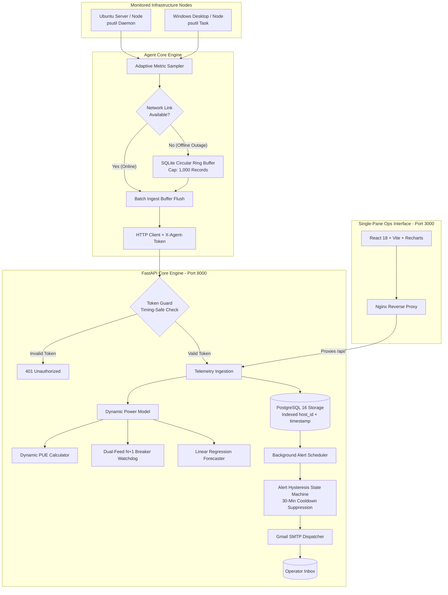
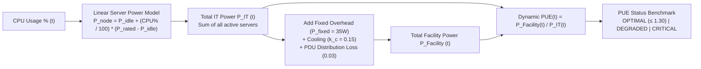
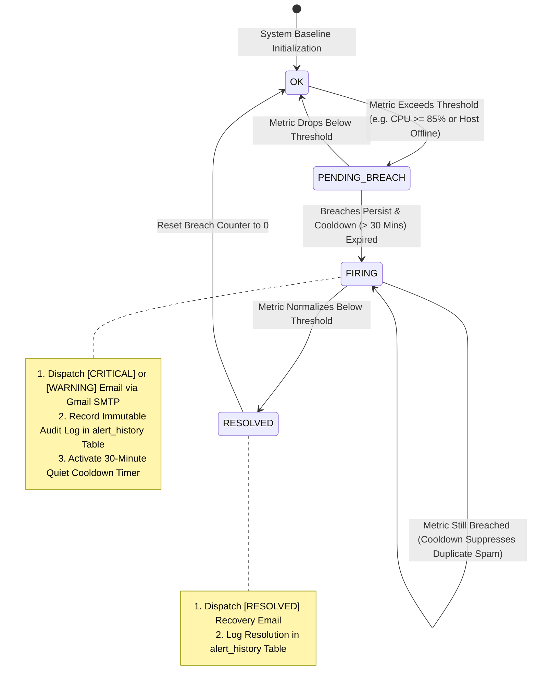
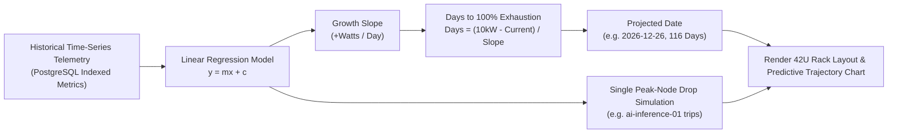

# ⚡ InfraPulse — Mini Data Center Infrastructure & Capacity Monitoring System

[](https://fastapi.tiangolo.com)
[](https://react.dev/)
[](https://www.typescriptlang.org/)
[](https://www.postgresql.org/)
[](https://tailwindcss.com/)
[](https://recharts.org/)
[](LICENSE)
[](https://membership-guarantee-forgotten-div.trycloudflare.com)

**🌐 Live Public Demo URL:** [https://membership-guarantee-forgotten-div.trycloudflare.com](https://membership-guarantee-forgotten-div.trycloudflare.com)


> **InfraPulse** is a lightweight, unified **IT Infrastructure & Critical Facility DCIM (Data Center Infrastructure Management)** monitoring platform designed for edge server rooms, branch offices, and homelabs. It bridges the gap between raw OS telemetry and physical electrical engineering by combining real-time hardware metrics with dynamic server power estimation, load-dependent PUE modeling, dual-feed (A/B) N+1 redundancy validation, 42U rack layout tracking, and predictive capacity forecasting.

---

## 📸 Screenshots & UI Showcase

| 🖥️ Real-Time Telemetry & Dual-Stream Throughput | ⚡ Capacity Forecasting & 42U Rack Elevation |
| :---: | :---: |
|  |  |
| *Live node status, CPU/RAM gauges, and Network RX/TX* | *Capacity Runout Forecast ($y=mx+c$), 42U rack & Monthly PUE logs* |

---

## 📌 Motivation & The Real-World Engineering Problem

### The Problem in Enterprise Edge & Small Server Rooms
In enterprise branch offices, factories, hospitals, and edge computing sites (5–50 physical servers and network switches), IT engineers face significant operational hurdles:
* **Cost & Complexity of Commercial DCIM:** Enterprise tools (Sunbird, Schneider EcoStruxure, Nlyte) cost millions of Baht and require dedicated sensor hardware.
* **Blind Spots in Standard Monitoring:** Common sysadmin tools (Netdata, Prometheus/Grafana) monitor OS metrics (CPU/RAM/Disk) but **completely ignore electrical capacity, PDU breaker safety, and facility power limits**.
* **Risk of Catastrophic Breaker Trips:** Adding new servers without real-time electrical headroom checks can trigger main breaker trips, taking down critical operations.

### Connecting to Thailand's Booming Data Center & Cloud Industry
With Thailand rapidly emerging as Southeast Asia's digital hub and the **Board of Investment (BOI)** granting tax incentives for energy-efficient Data Centers achieving **PUE $\le 1.30$**, monitoring electrical efficiency (Dynamic PUE) and power redundancy (N+1) has transitioned from an optional feature to an essential engineering standard.

**InfraPulse was built to solve this exact problem** by providing full DCIM capabilities in a modern, containerized, zero-licensing-cost stack.

---

## 🗺️ System Flowcharts & Subsystem Workflows

### 1. 🔄 End-to-End System Data Flow & Architecture




---

### 2. ⚡ Dynamic PUE & Physical Power Calculation Flow



---

### 3. 🛡️ Dual-Feed (A/B) N+1 Redundancy & Failover Safety Flow

```mermaid
flowchart TD
    START[Query Monitored Nodes & PDU Assignments] --> MAP[Map Servers to PDU-A1 (Feed A) and PDU-B1 (Feed B)]
    MAP --> DERATE[Apply NEC 80% Continuous Derate Rule<br/>Derated Capacity = 3680W * 0.800 = 2944W]
    DERATE --> SIM[Simulate Sudden Single-Feed Blackout<br/>Shift Total IT Load to Surviving Feed]
    SIM --> CHECK{Worst-Case Single-Feed Load<br/>≤ Surviving Derated Capacity?}
    CHECK -- Yes --> HEALTHY["Status: HEALTHY<br/>Safety Headroom Available (e.g. +1928W)"]
    CHECK -- No (Within 80-100%) --> ATRISK["Status: AT_RISK<br/>Warning: Breaker Operating Near Derate Limit"]
    CHECK -- No (> 100% Breaker Trip) --> NONCOMP["Status: NON_COMPLIANT<br/>Critical: Main Breaker Trip Risk on Blackout!"]
```

---

### 4. 🔔 Automated Hysteresis Alerting & Auto-Recovery Flow



---

### 5. 📈 Predictive Capacity Forecasting Flow ($y = mx + c$)



---

## ✨ Key Features & Capabilities

### 1. 🖥️ Cross-Platform Real-Time Telemetry
* **Lightweight Multi-Platform Agent:** Python collector using `psutil` (< 15MB RAM, < 0.1% CPU) running as a `systemd` daemon (Ubuntu/Linux) or Scheduled Task (Windows).
* **Network Reliability & Offline Ring Buffer:** Local SQLite circular buffer stores up to 1,000 snapshots during network partitions and auto-flushes on reconnect without losing original sampling timestamps.
* **Server-Calculated Liveness:** Heartbeat watchdog calculates exact `seconds_since_last_seen` with an automated 90-second offline threshold.

### 2. ⚡ Physical DCIM & Dynamic PUE Engine
* **Linear Server Power Estimation:** Estimates server wattage from instantaneous CPU utilization without requiring smart PDUs:
  $$P_{\text{node}}(t) = P_{\text{idle}} + \left( \frac{\text{CPU Usage \%}(t)}{100} \times (P_{\text{rated}} - P_{\text{idle}}) \right)$$
* **Load-Dependent Dynamic PUE with Fixed Overhead:** Accurately models non-linear facility overhead ($P_{\text{fixed}} = 35\text{W}$ baseline CRAC fan/lighting draw + variable cooling $k_c$ + distribution loss $\lambda_{\text{pdu}}$):
  $$\text{PUE}(t) = 1 + k_c + \lambda_{\text{pdu}} + \frac{P_{\text{fixed}}}{P_{\text{IT}}(t)}$$
  *(Proves the physical principle: as server workload increases, constant fixed overhead is diluted, driving PUE down toward optimal efficiency).*

### 3. 🛡️ Dual-Feed (A/B) N+1 Redundancy Watchdog
* **NEC 80% Continuous Derate Rule:** Automatically enforces National Electrical Code safety derating ($0.800$ factor) on PDU-A1 (Feed A) and PDU-B1 (Feed B).
* **Worst-Case Failover Simulation:** Evaluates in real-time whether a single surviving feed can sustain total IT load during a sudden single-feed blackout.

### 4. 📈 Predictive Capacity Forecasting
* **Linear Regression Model ($y = mx + c$):** Calculates facility power growth slope (Watts/Day) and projects the exact **Estimated Date until 100% Capacity Exhaustion**.
* **Single-Peak Node Drop Resilience:** Analyzes cluster stability if the single highest-power-consuming server trips or fails.
* **Monthly Power & Energy Audit Log:** Tracks historical utility meter bills (kWh) and verifies long-term PUE improvement over time.

### 5. 🔔 Hysteresis Alerting & SMTP Email Dispatcher
* **Severity-Tagged Subject Lines:** Dispatches automated HTML alerts tagged as `[CRITICAL]`, `[WARNING]`, `[RESOLVED]`, or `[INFO]` directly via Gmail SMTP.
* **Hysteresis State Machine & Cooldown (30 Mins):** Transitions through `OK` $\rightarrow$ `FIRING` $\rightarrow$ `RESOLVED` with 30-minute cooldown suppression to eliminate alert fatigue.
* **Immutable Audit Trail:** All alert events are permanently logged in PostgreSQL (`alert_history` table) for incident post-mortems.

---

## 🛠️ Tech Stack & Engineering Choices

| Layer | Technology | Rationale & Architectural Decisions |
| :--- | :--- | :--- |
| **Backend API** | **FastAPI (Python 3.11)** | High-performance asynchronous REST framework with native Pydantic v2 validation and OpenAPI/Swagger auto-generation. |
| **Database** | **PostgreSQL 16 Alpine** | Robust relational database utilizing composite index `(host_id, timestamp)` for sub-millisecond time-series queries and `ON DELETE CASCADE` integrity. |
| **Frontend** | **React 18 + TypeScript + Vite** | Strongly typed SPA with rapid HMR, modular atomic components, and zero runtime overhead. |
| **Styling & Charts** | **Tailwind CSS + Recharts** | High-contrast NOC dark theme with hardware-accelerated SVG Area, Bar, and Line charts. |
| **Reverse Proxy** | **Nginx 1.25 Alpine** | Serves static frontend and proxies `/api/` to backend on a single port (3000), eliminating CORS issues. |
| **Agent** | **Python + psutil + SQLite** | Cross-platform hardware metrics collection with local ring buffer protection during network outages. |
| **Containerization** | **Docker & Docker Compose** | Multi-stage container builds ensuring 1-command reproducible deployment across any OS. |

---

## 🚀 Quick Start Guide (3 Simple Commands)

### 1. Clone & Configure
```bash
git clone https://github.com/Disorn1998/infrapulse.git
cd infrapulse

# Copy environment template
cp .env.example .env
```

*(Optional: Edit `.env` with your Gmail App Password to enable live email alerts)*

### 2. Boot the Entire System
```bash
docker compose up -d --build
```

### 3. Open the Dashboard
Navigate to:
```text
http://localhost:3000
```
*(Or `http://<your-server-ip>:3000` from any device on your local network)*

* **Swagger API Docs:** [http://localhost:8000/docs](http://localhost:8000/docs)
* **ReDoc API Docs:** [http://localhost:8000/redoc](http://localhost:8000/redoc)

---

## 🎮 Interactive Live Demo & Simulation Suite

Don't have multiple physical servers available? Run the built-in simulation suite to experience full cluster telemetry, PUE shifts, and failover alerting immediately:

```bash
# 1. Provision a 4-Node Enterprise Cluster (Web Proxy, DB, AI Inference GPU, Storage NAS)
python scripts/simulate_cluster.py

# 2. Trigger Dynamic PUE Load Stress Test (Watch PUE improve from 1.25 -> 1.19 as load increases)
python scripts/simulate_power_stress.py

# 3. Simulate Total Electrical Feed A Outage & Verify N+1 Failover Safety Margin
python scripts/simulate_power_outage.py
```

---

## 💻 Installing the Agent on Monitored Nodes

### Ubuntu / Linux (systemd Service)
```bash
cd agent
pip install -r requirements.txt
sudo bash deploy/install_ubuntu_service.sh
```

### Windows (Background Task)
```powershell
cd agent
pip install -r requirements.txt
powershell -ExecutionPolicy Bypass -File deploy\install_windows_task.ps1
```

---

## 🌐 Setting Up a Public Live Demo via Cloudflare Tunnel (Free)

To share a live demo with recruiters or interviewers from anywhere without exposing your home IP or configuring port forwarding:

1. **Install `cloudflared`:**
   * **Windows:** `winget install Cloudflare.cloudflared`
   * **Linux/macOS:** `brew install cloudflared` or `sudo apt install cloudflared`
2. **Launch a Quick Tunnel pointing to Port 3000:**
   ```bash
   cloudflared tunnel --url http://localhost:3000
   ```
3. **Copy the generated HTTPS URL** (e.g. `https://random-words.trycloudflare.com`) and paste it into your portfolio / resume!

---

## 🔮 Future Roadmap & Enhancements

- [ ] **SNMP v2c/v3 Switch Traps:** Direct interface throughput and port status collection from physical Ruijie/Cisco edge switches.
- [ ] **Kubernetes Homelab Exporter:** DaemonSet exporter collecting pod power density metrics within lightweight K3s/MicroK8s clusters.
- [ ] **Multi-Tenant RBAC Authentication:** JWT-based user role management (Admin, Facility Operator, Read-only Auditor).
- [ ] **TimescaleDB Hypertable Integration:** Automatic automated time-series chunk compression and data retention policies for long-term historical archiving.

---

## 📄 License
This project is open-source and licensed under the [MIT License](LICENSE).
