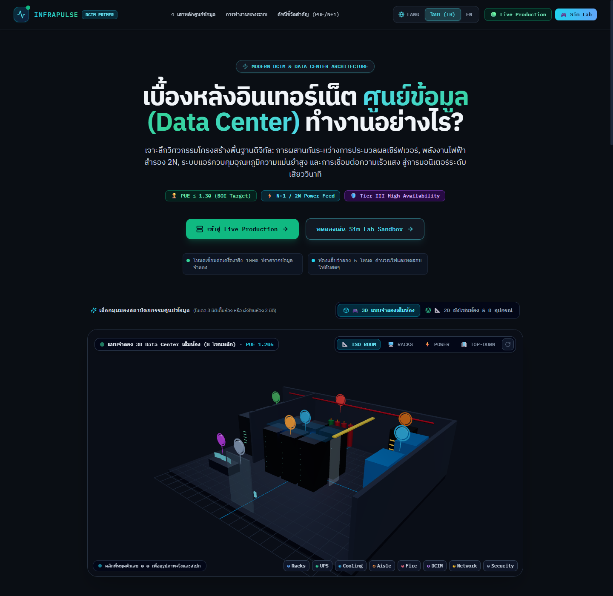
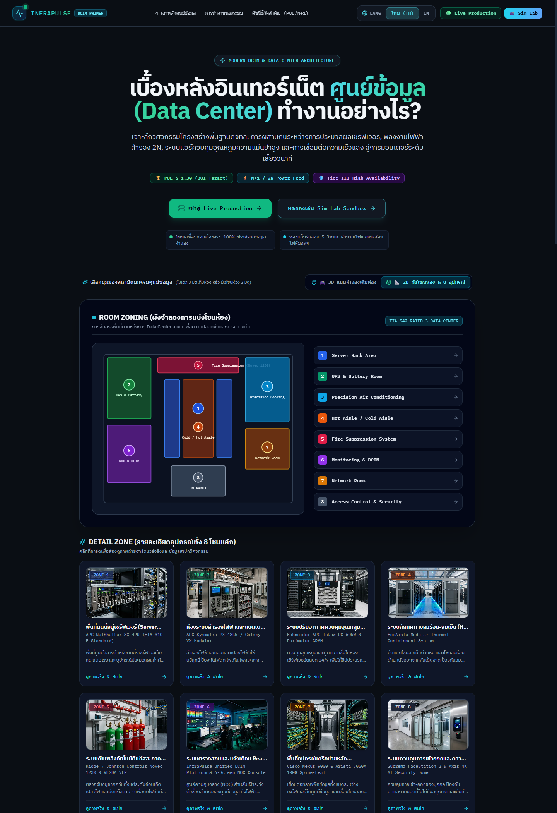
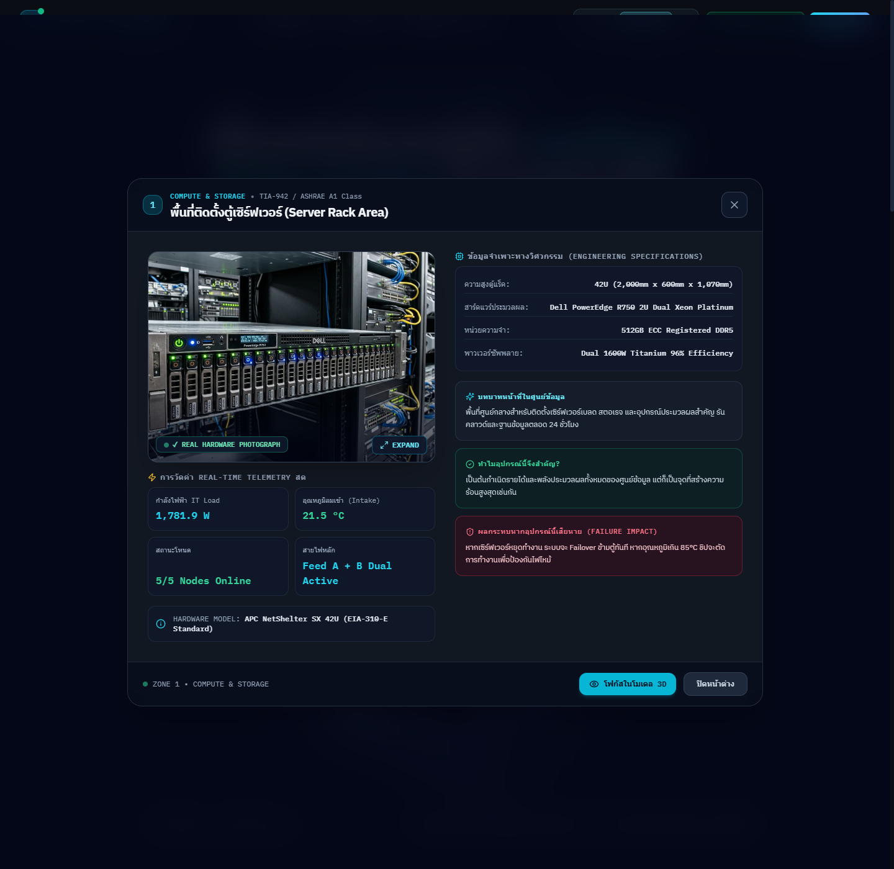
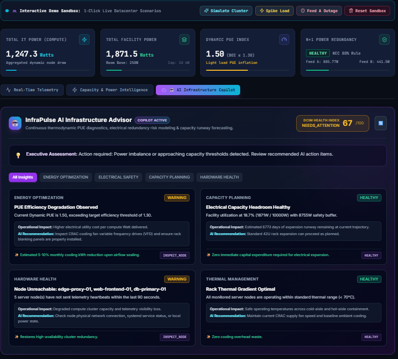
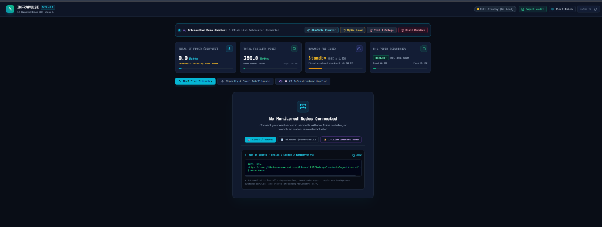
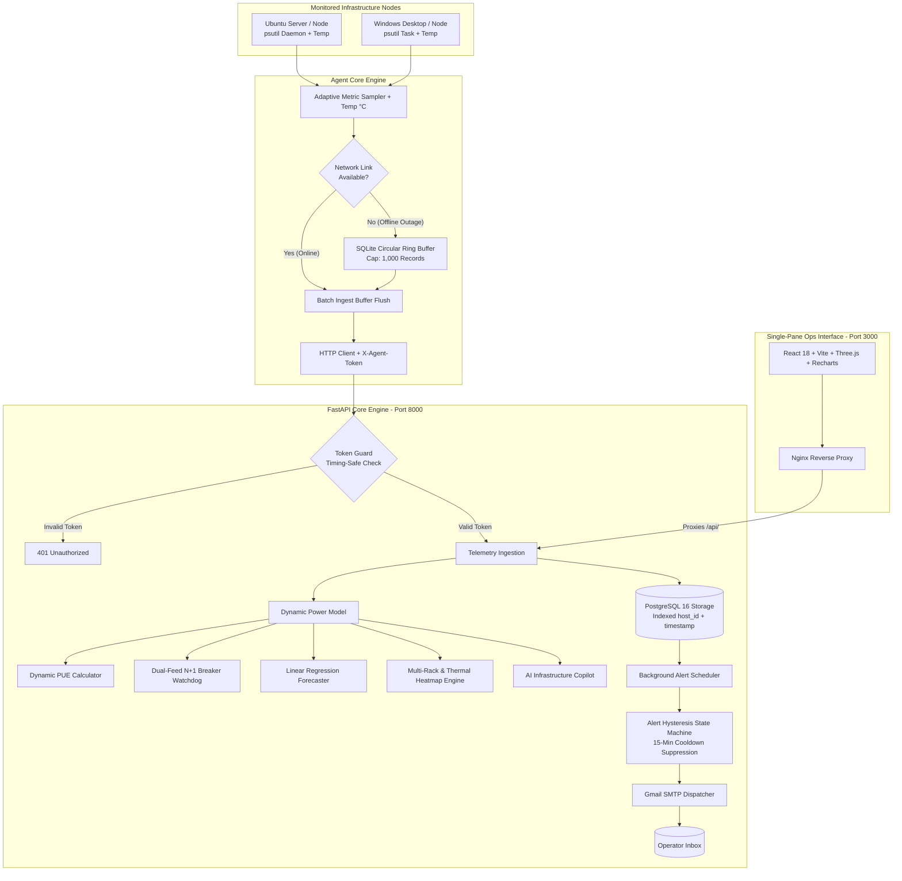

# ⚡ InfraPulse — Mini Data Center Infrastructure & Capacity Monitoring System

[](https://fastapi.tiangolo.com)
[](https://react.dev/)
[](https://www.typescriptlang.org/)
[](https://threejs.org/)
[](https://www.postgresql.org/)
[](https://tailwindcss.com/)
[](https://recharts.org/)
[](LICENSE)
[](https://infrapulse-0ft2.onrender.com/)

**🚀 24/7 Cloud Production Platform:** [https://infrapulse-0ft2.onrender.com/](https://infrapulse-0ft2.onrender.com/)  
**📖 Comprehensive User Manuals:** [🇹🇭 คู่มือการใช้งานภาษาไทย (Thai)](docs/USER_MANUAL_TH.md) | [🇬🇧 User & Operations Manual (English)](docs/USER_MANUAL_EN.md)

---

## 📌 Executive Summary

> **InfraPulse** is a unified **IT Infrastructure & Critical Facility DCIM (Data Center Infrastructure Management)** monitoring and architectural educational platform designed for edge server rooms, branch offices, and enterprise data centers.
>
> It bridges the gap between raw OS telemetry and physical electrical/thermal engineering by combining **real-time sub-second hardware metrics** with **dynamic server power estimation**, **rack thermal heatmap matrix**, **load-dependent PUE modeling (Thailand BOI Target $\le 1.30$)**, **dual-feed (A/B) N+1 redundancy validation**, **multi-rack layout tracking**, **predictive capacity forecasting**, and an **interactive 3D/2D 8-Zone Data Center Facility Architectural Showcase**.

---

## 📸 Screenshots & UI Showcase

| 🎮 3D WebGL Facility Room (8 Core Zones) | 📐 2D Room Zoning Blueprint & Detail Cards |
| :---: | :---: |
|  |  |
| *Interactive 360° WebGL cutaway room with 8 floating pins ❶-❽* | *Architectural top-down blueprint & 8 studio photo cards* |
| **🔬 Centered Physical Hardware Inspector** | **⚡ Real-Time DCIM Telemetry & Power View** |
|  |  |
| *High-res real hardware photo, specs & failure impact* | *Dynamic PUE, dual-feed power gauge & multi-rack elevation* |
| **🤖 AI Infrastructure Copilot** | **✨ 1-Line Universal Installers** |
|  |  |
| *DCIM Health Score, Thermal Hotspot Diagnostics & Power Insights* | *Instant cluster simulation and universal copy-paste installation* |

---

## 🏛️ Complete 8-Zone Enterprise Data Center Architecture

InfraPulse features a comprehensive architectural breakdown modeled after tier-grade mission-critical facilities:

| หมุด / Zone | ชื่อโซนสถาปัตยกรรม (Architecture Zone) | อุปกรณ์ฮาร์ดแวร์จริง (Real Hardware Model) | โค้ดสีประจำโซน |
| :---: | :--- | :--- | :---: |
| **❶** | **SERVER RACK AREA** | ตู้ 42U APC NetShelter SX + Dell PowerEdge R750 2U Dual Xeon | 🟦 สีน้ำเงิน |
| **❷** | **UPS & BATTERY ROOM** | APC Symmetra PX 48kW Modular UPS (True Online 0ms Transfer) | 🟩 สีเขียว |
| **❸** | **PRECISION AIR CONDITIONING** | Schneider InRow RC 60kW Chiller & CRAH with Modulating EC Fans | 🩵 สีฟ้า |
| **❹** | **HOT AISLE / COLD AISLE** | EcoAisle Modular Containment Pod with Polycarbonate Ceiling | 🟧 สีส้ม |
| **❺** | **FIRE SUPPRESSION SYSTEM** | ถังแก๊สสะอาด 3M Novec 1230 แรงดัน 25 Bar + เลเซอร์ตรวจจับ VESDA VLP | 🟥 สีแดง |
| **❻** | **MONITORING & DCIM** | InfraPulse Unified DCIM Platform & 6-Screen NOC Console Wall | 🟪 สีม่วง |
| **❼** | **NETWORK ROOM** | Cisco Nexus 9000 & Arista 100G Spine-Leaf + ราง FiberGuide สีเหลือง | 🟫 สีน้ำตาล |
| **❽** | **ACCESS CONTROL & SECURITY** | ประตูกักลม Airlock Mantrap + สแกนลายนิ้วมือ/ใบหน้า 3D + กล้อง 4K CCTV | ⬜ สีเทา |

### 6 เสาหลักระบบโครงสร้างพื้นฐาน (Infrastructure Systems):
1. ⚡ **Electrical System (ระบบไฟฟ้าและการจ่ายไฟ):** วงจรคู่ขนาน 2N พร้อม UPS สำรองไฟ 0ms ไร้รอยต่อ
2. ❄️ **Cooling System (ระบบปรับอากาศควบคุมอุณหภูมิ):** แอร์ควบคุมความชื้นและความเย็นแบบ Close-Coupled 24/7
3. 🔥 **Fire Protection (ระบบดับเพลิงอัตโนมัติ):** ดับเพลิงด้วยแก๊สสะอาด ไม่ใช้น้ำ ไม่ทำลายแผงวงจรอิเล็กทรอนิกส์
4. 🛡️ **Security System (ระบบรักษาความปลอดภัย):** ทางเข้า Mantrap ป้องกันการแอบตาม และการยืนยันตัวตนชีวมิติ
5. 🖥️ **Monitoring System (ระบบตรวจสอบและแจ้งเตือน):** มอนิเตอร์ค่าไฟฟ้า อุณหภูมิ และ PUE แบบ Real-Time
6. 🌐 **Network System (ระบบเครือข่ายและการสื่อสาร):** สถาปัตยกรรม Spine-Leaf ความเร็วสูง ไร้จุดคอขวด

---

## 🌟 Key Enterprise DCIM Features

1. **🎮 3D WebGL Facility Explorer & 2D Room Zoning Blueprint:**
   * สลับดูโมเดล 3 มิติเต็มห้อง หรือผังสีแบบสถาปัตยกรรม 2 มิติ (TIA-942 Rated-3 Standard)
   * หมุดตัวเลข ❶ ถึง ❽ ตอบสนองต่อการคลิก เพื่อเปิดหน้าต่างส่องดู **ภาพถ่ายฮาร์ดแวร์จริงระดับสตูดิโอ** พร้อมสเปกเชิงลึก
2. **🔬 Centered Physical Hardware Inspector:**
   * หน้าต่าง Dialog โมดอลขนาดใหญ่ตรงกลางจอ แสดงภาพถ่ายจริง WebP โหลดเร็วทันที
   * แจกแจงละเอียด 3 ด้าน: **บทบาทหน้าที่ในศูนย์ข้อมูล**, **ความสำคัญเชิงวิศวกรรม**, และ **ผลกระทบหากอุปกรณ์เสียหาย (Failure Impact)**
3. **🌡️ CPU Temperature & Multi-Rack Thermal Heatmap Matrix:**
   * เก็บอุณหภูมิ CPU Package ($^\circ	ext{C}$) สดผ่าน Linux Sensors / Windows WMI
   * ป้ายสีแสดงระดับความร้อน: 🟦 Cyan $\le 45^\circ	ext{C}$, 🟩 Green $\le 65^\circ	ext{C}$, 🟧 Amber $\le 75^\circ	ext{C}$, 🟥 Red $> 75^\circ	ext{C}$
4. **🏢 Multi-Rack Layout Switcher:**
   * สลับดูตู้แร็คแยกตามประเภทงาน: **`Rack-01 (Web & App)`**, **`Rack-02 (Database Clusters)`**, และ **`Rack-03 (AI/HPC GPU & Storage)`**
   * รวมกำลังไฟฟ้า รายการความจุ U-Space และเกรเดียนต์ความร้อนเฉลี่ยรายตู้
5. **⚡ Dynamic PUE Modeling & Dual-Feed N+1 Redundancy:**
   * คำนวณ PUE สดตามโหลดงานจริง เทียบกับเกณฑ์มาตรฐาน **Thailand BOI Green Data Center ($	ext{PUE} \le 1.30$)**
   * ประเมินความปลอดภัยของระบบไฟคู่ขนาน Feed A / Feed B ตามเกณฑ์ **NEC 80% Continuous Load Rule**
6. **🤖 AI Infrastructure Copilot:**
   * คำนวณ **DCIM Health Score (0–100)** พร้อมวินิจฉัยปัญหาไฟฟ้า ความร้อน จุดฮอตสปอต และการกระจายโหลด
7. **🚀 1-Line Universal Agent Installers:**
   * **Linux / Ubuntu:** `curl -sSL https://raw.githubusercontent.com/Disorn1998/infrapulse/main/agent/install.sh | sudo bash`
   * **Windows (PowerShell):** `irm https://raw.githubusercontent.com/Disorn1998/infrapulse/main/agent/install.ps1 | iex`
8. **📑 1-Click Export Audit Report (CSV & BOI Certificate):**
   * ดาวน์โหลดชุดข้อมูลดิบ CSV สำหรับตรวจสอบย้อนหลัง
   * พิมพ์เอกสารสรุปผลการตรวจรับรองมาตรฐานพลังงานสีเขียว BOI

---

## 📖 วิธีการใช้งานระบบ (Thai User Guide)

### 1. การสำรวจสถาปัตยกรรมศูนย์ข้อมูล (Data Center Architecture Explorer)
* **การเข้าสู่หน้า Landing Page:** เมื่อเปิดระบบครั้งแรก ท่านจะพบหน้าแรกที่อธิบายการทำงานของศูนย์ข้อมูล
* **การสลับมุมมอง 3D และ 2D:**
  * คลิกปุ่ม **`[ 🎮 3D แบบจำลองเต็มห้อง ]`** เพื่อหมุนดูห้องดาต้าเซ็นเตอร์แบบ 360 องศา มีปุ่มลัดมุมกล้อง `[ ISO ROOM ]`, `[ RACKS ]`, `[ POWER ]`, และ `[ TOP-DOWN ]`
  * คลิกปุ่ม **`[ 📐 2D ผังโซนห้อง & 8 อุปกรณ์ ]`** เพื่อดูผังสีแบบ Top-Down พร้อมการ์ดรูปถ่ายอุปกรณ์จริง 8 โซน
* **การตรวจสอบภาพถ่ายจริงและสเปก:**
  * คลิกที่ **หมุดหมายเลข ❶ ถึง ❽** หรือคลิกที่การ์ดอุปกรณ์ จะมีหน้าต่างโมดอลขนาดใหญ่เปิดขึ้นมาตรงกลางจอ
  * สามารถดูรูปถ่ายฮาร์ดแวร์จริง ค่าวัดทางไฟฟ้าสด ตารางสเปก และคลิกปุ่ม **`[ EXPAND ]`** เพื่อขยายดูรูปเต็มหน้าจอ

### 2. การสลับโหมด Live Production vs Sim Lab Sandbox
* **โหมด Live Production:**
  * คลิกปุ่ม **`[ เข้าสู่ Live Production ]`** หรือแท็บด้านบน
  * ใช้สำหรับเชื่อมต่อเครื่องเซิร์ฟเวอร์จริงในองค์กร 100% ปราศจากข้อมูลจำลอง
  * หากยังไม่มีเครื่องเชื่อมต่อ ระบบจะแสดง Empty State พร้อมคำสั่งติดตั้ง Agent 1 บรรทัด
* **โหมด Sim Lab Sandbox:**
  * คลิกปุ่ม **`[ ทดลองเล่น Sim Lab Sandbox ]`**
  * ระบบจะจำลองคลัสเตอร์เซิร์ฟเวอร์ 5 โหนด กระจายโหลดไฟ Feed A (~950W) และ Feed B (~820W) ให้ท่านทดลองใช้งานและศึกษาการคำนวณ DCIM ได้ทันที

### 3. การอ่านตัวชี้วัด DCIM และการบริหารความจุ (Capacity View)
* **ดัชนี PUE (Power Usage Effectiveness):**
  * มาตรฐาน BOI ประเทศไทยกำหนดให้ศูนย์ข้อมูลประหยัดพลังงานต้องมี $	ext{PUE} \le 1.30$
  * ในช่วงที่ IT Load ต่ำ ค่า PUE จะแกว่งตัวสูงขึ้นตามหลักฟิสิกส์ เนื่องจากมีพลังงานคงที่ของระบบแอร์และแสงสว่าง
* **การตรวจสอบไฟสำรอง N+1 Redundancy:**
  * ตรวจดูสถานะของ Feed A และ Feed B หากขึ้น **HEALTHY** แปลว่าหากสายไฟหลักเส้นใดเส้นหนึ่งดับ อีกเส้นทางจะสามารถรับโหลดแทนได้ 100% โดยไม่ทำให้เบรกเกอร์ทริป
* **การเปลี่ยนตู้แร็ค Multi-Rack:**
  * คลิกแท็บ **Rack-01**, **Rack-02**, หรือ **Rack-03** เพื่อดูการจัดวางเซิร์ฟเวอร์ในช่อง U1-U42 และตรวจจับจุดความร้อนสะสม (Thermal Hotspot)

### 4. การติดตั้ง Client Agent บนเครื่องแม่ข่ายจริง
* **สำหรับเครื่อง Ubuntu / Debian Linux:**
  ```bash
  curl -sSL https://raw.githubusercontent.com/Disorn1998/infrapulse/main/agent/install.sh | sudo bash
  ```
* **สำหรับเครื่อง Windows Server / Windows 10/11 (PowerShell Admin):**
  ```powershell
  irm https://raw.githubusercontent.com/Disorn1998/infrapulse/main/agent/install.ps1 | iex
  ```

---

## 📖 System Operations & Usage Guide (English)

### 1. Navigating the Data Center Architecture Explorer
* **Accessing the Showcase:** Open the root landing page to explore foundational data center engineering principles.
* **3D vs 2D Architectural Modes:**
  * Click **`[ 🎮 3D Facility Room ]`** for an interactive 360° WebGL cutaway view with smooth orbit controls and camera presets (`ISO ROOM`, `RACKS`, `POWER`, `TOP-DOWN`).
  * Click **`[ 📐 2D Room Zoning ]`** for a clean architectural floorplan color-coded by TIA-942 facility functions.
* **Inspecting Real Hardware & Specifications:**
  * Click any **numbered pin ❶ to ❽** or any equipment card to launch the **Centered Hardware Inspector**.
  * View high-resolution studio photographs, live electrical telemetry, engineering tables, role summaries, and failure impact analyses.
  * Click **`[ EXPAND ]`** for full-screen lightbox viewing.

### 2. Live Production vs Sim Lab Sandbox
* **Live Production Mode:** Displays strictly authenticated physical telemetry from production servers. If no nodes are connected, an intuitive onboarding guide with universal 1-line installers is displayed.
* **Sim Lab Sandbox Mode:** Instantly spins up a 5-node simulated cluster with live fluctuating workloads, Feed A (~950W) and Feed B (~820W) loads, and dynamic thermal gradients for training and demonstration.

### 3. DCIM Metrics & Capacity Forecasting
* **Dynamic PUE Index:** Evaluated continuously against the Thailand BOI Green Data Center benchmark ($	ext{PUE} \le 1.30$).
* **N+1 Dual-Feed Redundancy:** Validates whether surviving Feed A or Feed B can absorb 100% of facility load without violating the **NEC 80% continuous rating rule**.
* **Multi-Rack Elevation:** Toggle between `Rack-01`, `Rack-02`, and `Rack-03` to inspect vertical U-slot utilization and color-coded thermal badges.

---

## 🗺️ System Flowcharts & Subsystem Workflows

### 1. 🔄 End-to-End System Data Flow & Architecture



---

### 2. ⚡ Dynamic PUE & Physical Power Calculation Flow


---

## ⚡ Quick Start with Docker (Zero Configuration)

```bash
# 1. Clone repository
git clone https://github.com/Disorn1998/infrapulse.git
cd infrapulse

# 2. Launch complete production stack
docker compose up -d --build

# 3. Access interfaces
# Dashboard & 3D Primer: http://localhost:3000
# Backend API Docs: http://localhost:8000/docs
```

---

## 📄 License & Author

* **Author:** Disorn Suppartum ([@Disorn1998](https://github.com/Disorn1998))
* **License:** MIT License — Open for commercial, educational, and enterprise use.
