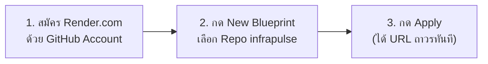

# ☁️ คู่มือการ Deploy InfraPulse ขึ้น Render.com ฟรี 24/7 (ไม่มีวันดับ)
**วิธีนำโปรเจกต์ขึ้น Cloud เพื่อให้มีลิงก์ HTTPS สดตลอด 24 ชม. แม้จะปิดคอมพิวเตอร์**

---

## 🌟 ทำไมต้อง Deploy ขึ้น Render.com?
1. **ฟรี 100% (Free Tier):** รองรับทั้ง Database (PostgreSQL), Backend (FastAPI), และ Frontend (React)
2. **ออนไลน์ตลอด 24 ชั่วโมง 365 วัน:** แม้คุณจะปิดคอมพิวเตอร์หรือนอนหลับอยู่ กรรมการสัมภาษณ์งานก็สามารถกดเปิดดู Live Demo ได้ตลอดเวลา
3. **ระบบอัตโนมัติ (Infrastructure as Code):** โปรเจกต์มีไฟล์ `render.yaml` เตรียมไว้ให้แล้ว Render จะสร้างระบบให้ครบทุกอย่างใน **3 คลิกจบ!**

---

## 🚀 ขั้นตอนการ Deploy ทีละสเต็ป (ใช้เวลาไม่เกิน 3 นาที)

### สเต็ปที่ 1: เข้าสู่ระบบ Render.com
1. เปิดเว็บเบราว์เซอร์ไปที่: **[https://render.com](https://render.com)**
2. คลิกปุ่ม **"GET STARTED"** หรือ **"Sign In"** แล้วเลือก **"Sign in with GitHub"** (ผูกกับบัญชี GitHub `Disorn1998` ของคุณ)

---

### สเต็ปที่ 2: สร้าง Blueprint อัตโนมัติ
1. ที่หน้า Dashboard ของ Render มองหาปุ่มสีฟ้าด้านบนขวา กดปุ่ม **"New +"**
2. เลือกเมนู **"Blueprint"** (สัญลักษณ์รูปพิมพ์เขียว 📐)
3. ในรายการ Repositories ให้ค้นหาและเลือก **`Disorn1998/infrapulse`** แล้วกดปุ่ม **"Connect"**

---

### สเต็ปที่ 3: ตรวจสอบและกด Deploy (Apply)
1. Render จะอ่านไฟล์ `render.yaml` อัตโนมัติ และแสดงรายการ 3 Services ที่จะสร้าง:
   - 🗄️ **`infrapulse-db`** (PostgreSQL Database - Free)
   - ⚡ **`infrapulse-backend`** (FastAPI Docker Web Service - Free)
   - 🖥️ **`infrapulse-dashboard`** (React Static Site with Global CDN - Free)
2. กดปุ่มสีเขียว **"Apply"** ด้านล่างสุด

---

### 🎉 สเต็ปที่ 4: รับลิงก์ Live Demo ถาวร!
* รอ Render ทำการ Build และ Start Service ประมาณ 2–3 นาที
* เมื่อเสร็จแล้ว คุณจะได้รับลิงก์ HTTPS ประจำตัว เช่น:
  * 👉 **Dashboard URL:** `https://infrapulse-dashboard.onrender.com`
  * 👉 **Swagger Docs API URL:** `https://infrapulse-backend.onrender.com/docs`
* นำลิงก์นี้ไปใส่ใน **GitHub About, Resume, และ LinkedIn** ได้อย่างถาวรโดยไม่ต้องกังวลเรื่องเปิด-ปิดคอมพิวเตอร์อีกต่อไปครับ! 🚀🎓
