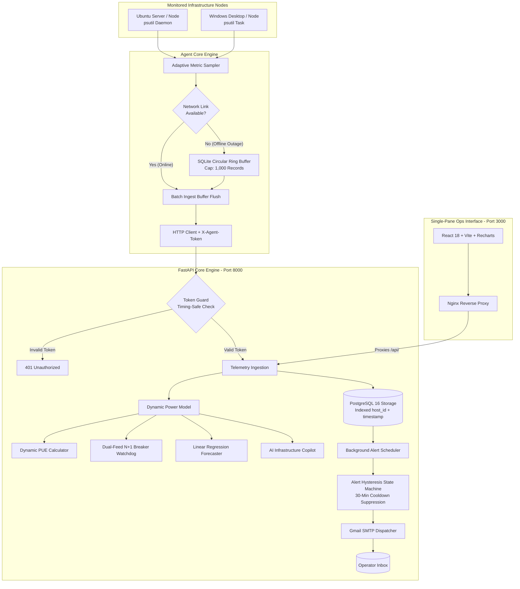

# ⚡ InfraPulse User & Operations Manual
**Mini Data Center Infrastructure & Capacity Management Platform (DCIM)**

---

## 🎯 1. Project Objectives & Purpose

### 📌 The Real-World Engineering Problem
In enterprise edge facilities, branch offices, factories, hospitals, and server rooms housing 5 to 50 physical servers and network switches:
1. **Commercial DCIM Software Is Cost-Prohibitive:** Enterprise systems (Schneider EcoStruxure, Sunbird, Nlyte) cost millions of Baht and require proprietary sensor hardware.
2. **Standard Monitoring Lacks Facility Physics:** Common sysadmin tools (Prometheus, Grafana, Netdata) focus purely on OS utilization (CPU/RAM/Disk) and remain **completely blind to electrical breaker capacity, PDU load balancing, and energy efficiency (PUE)**.
3. **Risk of Catastrophic Main Breaker Trips:** Adding new server compute without automated continuous capacity validation frequently triggers main electrical breaker trips during peak workloads.
4. **Uncertainty in Redundant Power Failover (N+1):** Facilities maintain dual utility feeds (Feed A / Feed B) but lack real-time validation whether a single surviving feed can sustain total IT load during an unannounced blackout.

### 💡 Purpose & Value Proposition of InfraPulse
* **Unified IT Telemetry & DCIM:** Bridges operating system metrics with electrical engineering physics within a single-pane-of-glass platform.
* **Aligned with Thailand BOI Green Data Center Standards:** Complies with energy efficiency benchmarks targeting **PUE $\le 1.30$** for tax incentives.
* **National Electrical Code (NEC) Compliance:** Automatically applies the **NEC 80% Continuous Load Derate rule ($0.800$ factor)** for circuit breaker safety.
* **Zero-Licensing Open-Source Stack:** Built on modern, reproducible containerized architecture (FastAPI, PostgreSQL 16, React 18 TypeScript, and Docker).
* **AI Infrastructure Copilot:** Integrated AI advisor delivering real-time DCIM Health Scores (0–100) and actionable engineering recommendations.

---

## ⚙️ 2. System Architecture & How It Works

InfraPulse integrates 6 core engineering subsystems operating concurrently in real-time:



---

### 🔬 Mathematical Formulations & Engineering Principles

#### 1. Dynamic Server Power Estimation (Linear Interpolation Model)
Estimates server electrical draw (Watts) based on instantaneous CPU compute:
$$P_{\text{node}}(t) = P_{\text{idle}} + \left( \frac{\text{CPU Usage \%}(t)}{100} \times (P_{\text{rated}} - P_{\text{idle}}) \right)$$
* *Example:* A server node with $P_{\text{idle}} = 25\text{W}$ and $P_{\text{rated}} = 120\text{W}$ operating at 50% CPU draws $25 + 0.5 \times (120 - 25) = 72.5\text{ Watts}$.

#### 2. Dynamic PUE with Fixed Baseline Facility Overhead
In physical data centers, CRAC cooling fans, lighting, and UPS idle losses create a constant baseline draw ($P_{\text{fixed}} = 35\text{W}$) that remains energized regardless of IT load:
$$P_{\text{Facility}}(t) = P_{\text{IT}}(t) + k_c P_{\text{IT}}(t) + \lambda_{\text{pdu}} P_{\text{IT}}(t) + P_{\text{fixed}}$$
$$\text{PUE}(t) = \frac{P_{\text{Facility}}(t)}{P_{\text{IT}}(t)} = 1 + k_c + \lambda_{\text{pdu}} + \frac{P_{\text{fixed}}}{P_{\text{IT}}(t)}$$
* *Physical Principle:* As server compute workload scales up, constant baseline overhead is diluted, driving Dynamic PUE down from $1.65 \rightarrow 1.19$ toward optimal thermodynamic efficiency ($\le 1.30$).

#### 3. Dual-Feed (A/B) N+1 Redundancy & NEC 80% Derating
Simulates a total failure on Feed A and evaluates whether Feed B alone can sustain total cluster load under the **NEC 80% continuous rating limit ($3,680\text{W} \times 0.800 = 2,944\text{W}$)**:
* $\sum P_{\text{IT}} \le 2,944\text{W} \rightarrow$ **`HEALTHY`** (Safe electrical headroom)
* $\sum P_{\text{IT}} > 2,944\text{W} \rightarrow$ **`NON_COMPLIANT`** (Critical breaker trip risk upon single-feed outage)

#### 4. Predictive Capacity Forecasting via Linear Regression ($y = mx + c$)
Performs time-series trend analysis on historical electrical draw to determine daily growth slope $m$ (Watts/Day) and project the exact date of 100% capacity exhaustion:
$$\text{Days to Exhaustion} = \frac{\text{Total Capacity (10,000 W)} - \text{Current Power}}{\text{Growth Slope (Watts/Day)}}$$

#### 5. Hysteresis Alerting Engine & Cooldown Suppression
* State Machine transitions: `OK` $\rightarrow$ `PENDING` $\rightarrow$ `FIRING` $\rightarrow$ `RESOLVED`
* **30-Minute Cooldown Window:** Suppresses duplicate emails during ongoing outages.
* **Auto-Recovery Notifications:** Automatically dispatches a **`[RESOLVED]`** email as soon as telemetry normalizes.

#### 6. AI Infrastructure Copilot & DCIM Diagnostics
* Generates real-time **DCIM Health Score (0–100)**
* Detects electrical phase imbalances across Feed A and Feed B
* Delivers prioritized, actionable AI recommendations for energy conservation, breaker load balancing, and capacity runway management.

---

## 📖 3. Step-by-Step Installation & Operations Guide

### 🚀 Step 1: Boot the Central Monitoring Stack
1. Ensure Docker Desktop is installed and running.
2. Open terminal in the project directory:
   ```bash
   cd infrapulse
   cp .env.example .env
   docker compose up -d --build
   ```
3. Open browser: **`http://localhost:3000`**

---

### 💻 Step 2: Deploy the Agent on Monitored Nodes

#### Ubuntu / Linux (systemd Background Service):
```bash
cd infrapulse/agent
pip install -r requirements.txt
sudo bash deploy/install_ubuntu_service.sh
```

#### Windows (Task Scheduler Service):
```powershell
cd infrapulse\agent
pip install -r requirements.txt
powershell -ExecutionPolicy Bypass -File deploy\install_windows_task.ps1
```

---

### 🖥️ Step 3: Operating the Web Dashboard

#### 1. `🎮 Interactive Demo Sandbox` (Top Toolbar):
* **`🚀 Simulate Cluster` Button:** 1-Click provisions 4 enterprise server nodes (Proxy, DB, AI, Storage) into 42U rack.
* **`⚡ Spike Load (PUE Curve)` Button:** 1-Click scales cluster CPU to 92%, demonstrating PUE optimization in real-time.
* **`🔌 Feed A Outage` Button:** 1-Click simulates Feed A blackout, validating N+1 failover headroom.

#### 2. `🖥️ Real-Time Telemetry` Tab:
* **Node Inventory Cards:** Live Online/Offline badges (pulsing green when heartbeat received within 90 seconds).
* **Metric Gauges:** Real-time CPU %, RAM %, and Disk % gauges.
* **Dual-Stream Network Chart:** Distinct curves for received bandwidth (`RX Received` - Green) and transmitted bandwidth (`TX Transmitted` - Amber).

#### 3. `⚡ Capacity & Power Intelligence` Tab:
* **Electrical Capacity Gauge:** Total facility wattage draw vs 10 kW breaker rating.
* **Capacity Runout Forecaster:** Linear regression trajectory chart projecting runout dates.
* **42U Rack Elevation View:** Graphical 42U rack showing occupied server slots and assigned feeds (Feed A vs Feed B).
* **Historical Monthly Energy Audits:** Long-term PUE improvement bar chart with an **"+ Add Monthly Audit"** modal for entering utility invoices.

#### 4. `🤖 AI Infrastructure Copilot` Tab:
* **DCIM Health Index Gauge:** Overall score (0-100) reflecting thermodynamic, electrical, and hardware integrity.
* **Executive Summary:** High-level operational assessment for engineering leadership.
* **Smart Insight Cards:** Category-tagged recommendations with estimated efficiency gains and actionable remediation paths.

---

### 📧 Step 4: Configuring Live Email Alerts (Gmail SMTP)
Edit [`.env`](file:///c:/Users/msi/Desktop/disorn/project/infrapulse/.env) with your 16-character Gmail App Password:
```env
SMTP_HOST=smtp.gmail.com
SMTP_PORT=587
SMTP_USER=your_email@gmail.com
SMTP_PASSWORD=your_16_character_app_password
SMTP_FROM_EMAIL=your_email@gmail.com
DEFAULT_ALERT_RECIPIENT=your_email@gmail.com
```
*Test email delivery:*
```bash
curl -X POST "http://localhost:8000/api/v1/alerts/test?recipient_email=your_email@gmail.com"
```

---

### 🌐 Step 5: Sharing a Public Live Demo Link via Cloudflare Tunnel (Free)
Generate a public HTTPS URL accessible from anywhere worldwide without opening firewall ports:
```powershell
cd infrapulse
.\cloudflared.exe tunnel --url http://localhost:3000
```
Copy the generated HTTPS URL (e.g. `https://xxx.trycloudflare.com`) and paste it into your resume or portfolio!
