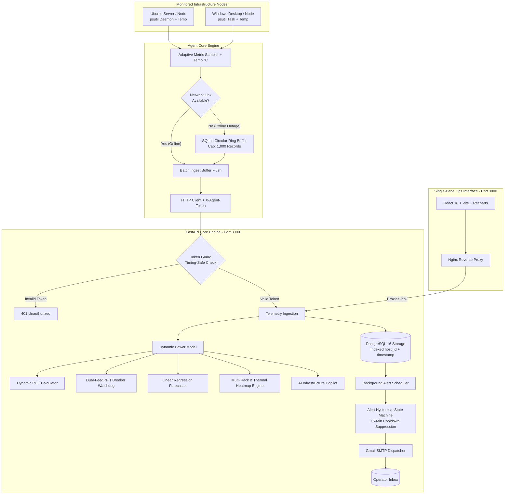

# ⚡ InfraPulse User & Operations Manual
**Mini Data Center Infrastructure & Capacity Management Platform (DCIM)**

---

## 🎯 1. Purpose & Motivation

### 📌 The Real-World Engineering Problem
In enterprise branch offices, factories, hospitals, and edge computing sites (5–50 physical servers and network switches):
1. **Commercial DCIM Software is Prohibitively Expensive:** Enterprise tools cost millions of Baht and demand proprietary sensor hardware.
2. **Standard Monitoring Tools Lack Electrical & Thermal Awareness:** Prometheus, Grafana, and Netdata monitor CPU/RAM/Disk but **completely ignore rack breaker capacity, PUE efficiency, and thermal rack distribution**.
3. **Risk of Catastrophic Breaker Trips:** Connecting new hardware without real-time electrical headroom checks can trigger main breaker trips.
4. **Uncertainty in N+1 Electrical Redundancy:** Facilities have Dual Feeds (A/B) but cannot simulate whether a single-feed outage will cause cascading breaker overloads.

### 💡 The Solution: InfraPulse
* **Unifies IT Telemetry with Physical DCIM:** Gathers OS metrics and calculates real-time power physics and thermal index in a single interface.
* **Thailand BOI Green Data Center Compliance:** Tracks dynamic PUE against the **PUE $\le 1.30$** tax incentive standard.
* **International Electrical Safety:** Enforces **NEC 80% Continuous Load Derate** limits.
* **Zero-Licensing Cost:** 100% open-source stack on FastAPI, PostgreSQL, React TypeScript, and Docker.
* **AI Infrastructure Copilot:** Evaluates data center health score (0–100) and produces automated engineering recommendations.

---

## ⚙️ 2. Architecture & Subsystems



---

## 🚀 3. Quickstart: 1-Line Universal Agent Installers

### On Windows (PowerShell):
Run PowerShell and execute:
```powershell
irm https://raw.githubusercontent.com/Disorn1998/infrapulse/main/agent/install.ps1 | iex
```

#### For Linux / Ubuntu (via Terminal):
Run the following 1-line command to install and start the background daemon:
```bash
curl -sSL https://raw.githubusercontent.com/Disorn1998/infrapulse/main/agent/install.sh | sudo bash
```

---

## 🖥️ 4. How to Read Metrics & Dashboard Usage

The dashboard is structured into 3 main tabs, covering both Software (IT) and Hardware/Electrical (Facility) dimensions.

### 📊 Tab 1: Real-Time Telemetry (Live Server Status)
This interface provides per-second health monitoring of individual server nodes.
* **How to Read Status:** Healthy servers show `🟢 Online`. If network or power is lost, it changes to `🔴 Offline`.
* **How to Read Thermal Badges:** Each node card features a **🌡️ XX.X°C** indicator:
  * 🟦 **Cyan (< 45°C):** Cool (Idle workload).
  * 🟩 **Green (45-65°C):** Optimal operating temperature.
  * 🟧 **Amber (65-75°C):** Elevated temperature; monitor for airflow issues.
  * 🟥 **Red (> 75°C):** Thermal Hotspot; high risk of CPU thermal throttling.
* **Network Chart (RX/TX):** The green line represents RX (incoming/download) and the orange line represents TX (outgoing/upload) throughput.

### ⚡ Tab 2: Capacity & Power Intelligence (DCIM Core)
This is the core facility management tab for monitoring the entire Data Center room.
* **How to Read Dynamic PUE Index (Top left):**
  * **PUE (Power Usage Effectiveness)** measures electrical efficiency. Closer to `1.0` is better.
  * The **Thailand BOI** standard for green data center tax incentives is **$\le 1.30$**.
  * *Note:* During low IT workload (idle) periods, PUE will naturally spike higher because fixed facility overhead (cooling, lighting) remains constant while IT power drops.
* **How to Read N+1 Power Redundancy:**
  * **HEALTHY:** Means if one power feed (e.g., Feed A) fails, the surviving Feed B can safely carry the entire room's load without tripping the breaker (safe under the NEC 80% continuous load rule).
* **How to Read Predictive Power Growth (Capacity Runout):**
  * The chart plots a Linear Regression slope (Watts per day) based on historical usage.
  * **Days to Exhaustion:** The AI automatically projects how many days until the 100% breaker capacity is hit, allowing you to plan phase expansions and budget approvals proactively.
* **How to use Multi-Rack Thermal Heatmap:**
  * Click to switch between **`Rack-01`**, **`Rack-02`**, or **`Rack-03`**.
  * Look at the U-slots (U1 - U42) to see where servers are physically installed, which PDU Feed they draw from (A or B), and visually identify thermal hotspots in the rack via color-coded badges.
* **How to record Historical Monthly Audits:**
  * Click **"+ Add Monthly Audit"** to log your monthly utility bill (kWh) and IT equipment kWh.
  * The system calculates and securely stores the monthly PUE history in PostgreSQL, generating long-term compliance reports for ISO or BOI audits.

### 🤖 Tab 3: AI Infrastructure Copilot
Stop manually interpreting charts—let the AI summarize the facility health!
* **DCIM Health Score (0-100):** The overall health grade of your data center.
* **How to Read Smart Insight Cards:**
  * The AI Engine generates dynamic, real-time alerts (CRITICAL, WARNING, INFO) based on the database telemetry.
  * *Example:* If too many servers are plugged into Feed A, the AI detects the load delta and issues an *"A/B Dual-Feed Power Imbalance"* warning, recommending you migrate plugs to Feed B to restore 50/50 balance.

### ⚙️ Header Controls (Alerts & Exports)
* **⚙️ Alert Rules:** Click the gear icon to adjust threshold sliders for CPU, RAM, Disk, and Temperature. If a threshold is breached, the system sends an automated Email Notification (with a 15-minute debounce to prevent spam).
* **📑 Export Audit:** Click the spreadsheet icon to instantly download a **.CSV** containing your raw server inventory, power telemetry, and monthly PUE audits for Excel reporting.

---

## 🌐 5. Online Access & Live URLs

* **🚀 24/7 Cloud Production Dashboard:** [https://infrapulse-0ft2.onrender.com/](https://infrapulse-0ft2.onrender.com/)
* **🌐 Cloudflare Tunnel Live Demo:** [https://membership-guarantee-forgotten-div.trycloudflare.com](https://membership-guarantee-forgotten-div.trycloudflare.com/)
* **📚 Interactive OpenAPI/Swagger Docs:** [https://infrapulse-backend-fddp.onrender.com/docs](https://infrapulse-backend-fddp.onrender.com/docs)
