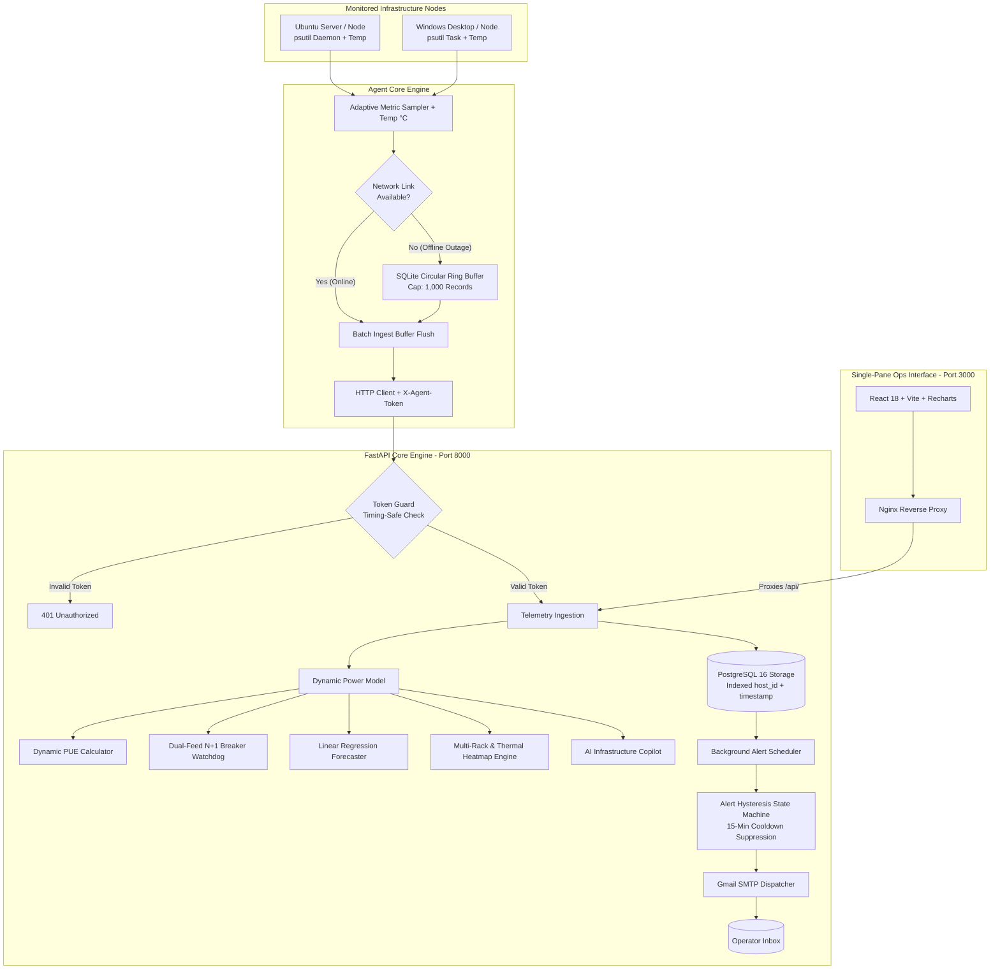

# ⚡ InfraPulse User & Operations Manual
**Mini Data Center Infrastructure & Capacity Management Platform (DCIM)**

---

## 🎯 1. Purpose & Motivation

### 📌 The Real-World Engineering Problem
In enterprise branch offices, factories, hospitals, and edge computing sites (5–50 physical servers and network switches):
1. **Commercial DCIM Software is Prohibitively Expensive:** Enterprise tools cost millions of Baht and demand proprietary sensor hardware.
2. **Standard Monitoring Tools Lack Electrical & Thermal Awareness:** Prometheus, Grafana, and Netdata monitor CPU/RAM/Disk but **completely ignore rack breaker capacity, PUE efficiency, and thermal rack distribution**.
3. **Risk of Catastrophic Breaker Trips:** Connecting new hardware without real-time electrical headroom checks can trigger main breaker trips.
4. **Uncertainty in N+1 Electrical Redundancy:** Facilities have Dual Feeds (A/B) but cannot simulate whether a single-feed outage will cause cascading breaker overloads.

### 💡 The Solution: InfraPulse
* **Unifies IT Telemetry with Physical DCIM:** Gathers OS metrics and calculates real-time power physics and thermal index in a single interface.
* **Thailand BOI Green Data Center Compliance:** Tracks dynamic PUE against the **PUE $\le 1.30$** tax incentive standard.
* **International Electrical Safety:** Enforces **NEC 80% Continuous Load Derate** limits.
* **Zero-Licensing Cost:** 100% open-source stack on FastAPI, PostgreSQL, React TypeScript, and Docker.
* **AI Infrastructure Copilot:** Evaluates data center health score (0–100) and produces automated engineering recommendations.

---

## ⚙️ 2. Architecture & Subsystems



---

## 🚀 3. Quickstart: 1-Line Universal Agent Installers

### On Windows (PowerShell):
Run PowerShell and execute:
```powershell
irm https://raw.githubusercontent.com/Disorn1998/infrapulse/main/agent/install.ps1 | iex
```

#### For Linux / Ubuntu (via Terminal):
Run the following 1-line command to install and start the background daemon:
```bash
curl -sSL https://raw.githubusercontent.com/Disorn1998/infrapulse/main/agent/install.sh | sudo bash
```

---

## 🖥️ 4. Dashboard Features & Operations

### 1. 🎮 Interactive Demo Sandbox (Top Bar)
* **`🚀 Simulate Cluster`:** Provisons 5 enterprise nodes distributed across **`Rack-01`**, **`Rack-02`**, and **`Rack-03`**.
* **`⚡ Spike Load (PUE Curve)`:** Simulates 92% CPU surge demonstrating thermodynamic Fixed Overhead Dilution.
* **`🔌 Feed A Outage`:** Simulates single-feed failure and validates N+1 failover headroom.

### 2. 🖥️ Real-Time Telemetry Tab
* **Node Cards:** Live Online/Offline status, uptime counter, and **`🌡️ XX.X°C`** thermal pill (Cyan/Green/Amber/Red).
* **Metric Gauges:** Real-time CPU %, RAM %, and Disk % utilization.
* **Dual-Stream Network Chart:** Independent green line for RX (incoming) and orange line for TX (outgoing) throughput.

### 3. ⚡ Capacity & Power Intelligence Tab
* **Facility Capacity Gauge:** Electrical load against rated breaker limits (10,000 W).
* **Capacity Runout Forecast:** Linear regression trajectory and estimated days to exhaustion.
* **Multi-Rack Elevation & Thermal Heatmap Matrix:**
  * Interactive switcher between **`Rack-01 (Web & App)`**, **`Rack-02 (Database)`**, and **`Rack-03 (AI/HPC GPU & Storage)`**.
  * Visual thermal heatmap per rack unit slot (U1–U42).
* **Historical Monthly Energy & PUE Audit Log:** Audit bar chart with **"+ Add Monthly Audit"** and **"Export DCIM Audit Report"** buttons.

### 4. 🤖 AI Infrastructure Copilot Tab
* **DCIM Health Score (0–100):** Comprehensive facility health evaluation.
* **Executive Summary:** Plain-language executive overview.
* **Smart Insight Cards:** Actionable engineering recommendations for hotspot cooling, phase balancing, and PUE optimization.

### 5. ⚙️ Alert Rules Settings (Header Gear Button)
* Interactive sliders for **CPU %, RAM %, Disk %, and Thermal Hotspot (°C)** thresholds.
* Live notification email configuration with instant persistence.

### 6. 📑 Export Audit Report (Header Export Button)
* **Download CSV Raw Dataset:** Full CSV export of node inventory, power draw, and historical monthly audits.
* **Print Executive Summary:** Printable audit sheet with **Thailand BOI Compliance Certificate ($\text{PUE} \le 1.30$)**.

---

## 🌐 5. Online Access & Live URLs

* **🚀 24/7 Cloud Production Dashboard:** [https://infrapulse-0ft2.onrender.com/](https://infrapulse-0ft2.onrender.com/)
* **🌐 Cloudflare Tunnel Live Demo:** [https://membership-guarantee-forgotten-div.trycloudflare.com](https://membership-guarantee-forgotten-div.trycloudflare.com/)
* **📚 Interactive OpenAPI/Swagger Docs:** [https://infrapulse-backend-fddp.onrender.com/docs](https://infrapulse-backend-fddp.onrender.com/docs)
