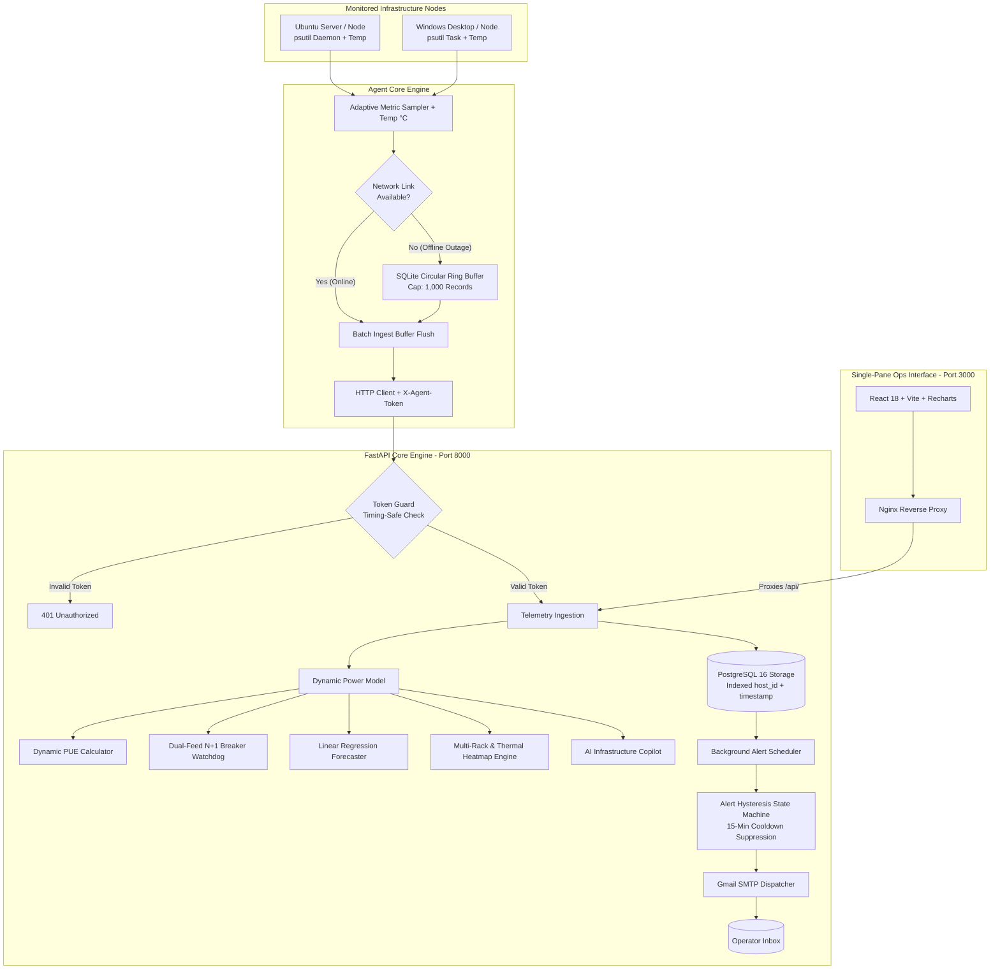

# ⚡ คู่มือการใช้งานระบบ InfraPulse (InfraPulse User & Operations Manual)
**ระบบมอนิเตอร์โครงสร้างพื้นฐานและบริหารจัดการความจุดาต้าเซ็นเตอร์ขนาดเล็ก (Mini Data Center Infrastructure & Capacity Management Platform - DCIM)**

---

## 🎯 1. จุดประสงค์ของโครงการ (Objectives & Purpose)

### 📌 ปัญหาที่พบในชีวิตจริง (The Real-World Problem)
ในห้อง Server Room หรือ Edge Data Center ขององค์กร, โรงงานอุตสาหกรรม, โรงพยาบาล หรือสาขาย่อย (ที่มีเซิร์ฟเวอร์ประมาณ 5–50 เครื่อง และอุปกรณ์เครือข่าย):
1. **ซอฟต์แวร์ DCIM ระดับองค์กรมีราคาสูงเกินไป:** ซอฟต์แวร์อย่าง Schneider EcoStruxure, Sunbird หรือ Nlyte มีค่าลิขสิทธิ์หลักล้านบาท และต้องซื้อเซนเซอร์ไฟฟ้าเฉพาะทาง
2. **เครื่องมือมอนิเตอร์ทั่วไปมองไม่เห็นมิติด้านไฟฟ้าและความร้อน:** ซอฟต์แวร์ Sysadmin ทั่วไปอย่าง Prometheus, Grafana หรือ Netdata มอนิเตอร์ได้เฉพาะ CPU/RAM/Disk แต่ **ไม่รู้ว่าไฟตู้แร็คใกล้เต็มเบรกเกอร์หรือยัง ไม่รู้ประสิทธิภาพพลังงาน (PUE) และไม่มีผังความร้อนของตู้แร็ค (Thermal Heatmap)**
3. **ความเสี่ยงเบรกเกอร์ทริปจากการขยายระบบ:** เมื่อซื้อเซิร์ฟเวอร์มาเพิ่ม หากเสียบปลั๊กโดยไม่รู้ความจุไฟฟ้าจริง อาจทำให้เบรกเกอร์หลักตัด และระบบไอทีล่มทั้งบริษัท
4. **ความไม่แน่นอนของระบบไฟสำรอง (N+1 Failover):** มีรางไฟ 2 สาย (Feed A / Feed B) แต่ไม่เคยทดสอบคำนวณจริงว่าถ้า Feed ใด Feed หนึ่งดับกะทันหัน อีกฝั่งจะรับโหลดไหวไหม หรือจะตัดตามไปอีกตัว

### 💡 เป้าหมายของ InfraPulse
* **ผสาน IT Telemetry เข้ากับ DCIM:** รวมการเก็บข้อมูลเครื่องลูกข่ายเข้ากับการคำนวณฟิสิกส์ไฟฟ้าและความร้อนในแพลตฟอร์มเดียว
* **สอดคล้องกับมาตรฐานอุตสาหกรรม Data Center ไทย:** รองรับเกณฑ์ชี้วัด PUE ($\le 1.30$) ตามมาตรฐานส่งเสริมการลงทุน **BOI Data Center**
* **ยึดตามมาตรฐานความปลอดภัยไฟฟ้าสากล:** ใช้เกณฑ์ **NEC 80% Continuous Load Derate** ในการประเมินโหลดเบรกเกอร์
* **Zero-Licensing Cost:** ทำงานบน Open-Source Stack (FastAPI + PostgreSQL 16 + React TypeScript + Docker) ที่นำไปติดตั้งใช้งานได้ฟรีทันที
* **AI Infrastructure Copilot:** มีระบบ AI วิเคราะห์สุขภาพห้องดาต้าเซ็นเตอร์ (DCIM Health Score 0-100) และให้คำแนะนำเชิงวิศวกรรมอัตโนมัติ

---

## ⚙️ 2. สถาปัตยกรรมและหลักการทำงานของระบบ (How It Works)

InfraPulse ประกอบด้วยโมดูลวิศวกรรมหลักที่ทำงานร่วมกันแบบ Real-Time:



---

## 🚀 3. ขั้นตอนการติดตั้งและเริ่มใช้งาน (Quickstart Guide)

### 🖥️ ขั้นตอนที่ 1: ติดตั้ง Client Agent บนเครื่องแม่ข่าย/ลูกข่าย (1 คำสั่งจบ)

#### บนระบบปฏิบัติการ Windows (รันผ่าน PowerShell):
เปิด PowerShell แล้ววางคำสั่ง 1 บรรทัดนี้:
```powershell
irm https://raw.githubusercontent.com/Disorn1998/infrapulse/main/agent/install.ps1 | iex
```

#### บนระบบปฏิบัติการ Linux / Ubuntu:
เปิด Terminal แล้ววางคำสั่ง 1 บรรทัดนี้:
```bash
curl -sSL https://raw.githubusercontent.com/Disorn1998/infrapulse/main/agent/install.sh | bash
```

---

## 🖥️ 4. การใช้งานหน้าจอ Dashboard และฟีเจอร์ระดับ Enterprise

### 1. แถบเครื่องมือ `🎮 Interactive Demo Sandbox` (ด้านบนสุด):
* **ปุ่ม `🚀 Simulate Cluster`:** กดคลิกเดียวเพื่อจำลองเซิร์ฟเวอร์ 5 เครื่องกระจายลง **`Rack-01`**, **`Rack-02`**, และ **`Rack-03`**
* **ปุ่ม `⚡ Spike Load (PUE Curve)`:** จำลองโหลดพุ่ง 92% ดูค่า PUE ลดลงตามทฤษฎี Fixed Overhead Dilution สดๆ
* **ปุ่ม `🔌 Feed A Outage`:** จำลองไฟดับ Feed A เพื่อทดสอบความทนทาน N+1 Redundancy

### 2. แท็บ `🖥️ Real-Time Telemetry`:
* **Node Cards:** ดูสถานะ Online/Offline, ค่า Uptime (เช่น `6d 23h`), และ Badge อุณหภูมิความร้อน **`🌡️ XX.X°C`** (ฟ้า/เขียว/ส้ม/แดง)
* **Metric Gauges:** วัดโหลด CPU %, RAM %, และ Disk %
* **Dual-Stream Network Chart:** กราฟเส้นแยกข้อมูลรับเข้า (`RX Received` - สีเขียว) และส่งออก (`TX Transmitted` - สีส้ม)

### 3. แท็บ `⚡ Capacity & Power Intelligence`:
* **Facility Capacity Gauge:** ดู % การใช้ไฟฟ้าเทียบกับขีดจำกัดเบรกเกอร์ (10,000 W)
* **Capacity Runout Forecast:** ดูกราฟพยากรณ์และวันที่คาดว่าไฟจะเต็ม 100%
* **Multi-Rack Elevation & Thermal Heatmap Matrix:**
  * สลับดูผังตู้ **`Rack-01 (Web & App)`**, **`Rack-02 (Database)`**, หรือ **`Rack-03 (AI/HPC GPU & Storage)`**
  * ดูตำแหน่งเซิร์ฟเวอร์แต่ละ U (U1–U42) พร้อมเฉดสี Heatmap บอกความร้อนของแต่ละช่องแร็ค
* **Historical Monthly Energy & PUE Audit Log:** ดูกราฟเปรียบเทียบบิลค่าไฟย้อนหลัง, กด **"+ Add Monthly Audit"**, และกด **"Export DCIM Audit Report"**

### 4. แท็บ `🤖 AI Infrastructure Copilot`:
* **DCIM Health Score (0–100):** คะแนนสุขภาพรวมของศูนย์ข้อมูล
* **Executive Summary:** บทวิเคราะห์สรุปสำหรับผู้บริหาร
* **Smart Insight Cards:** การ์ดคำแนะนำตรวจจับ Hotspot ความร้อน, ความสมดุลของตู้แร็ค, และโอกาสประหยัดพลังงาน

### 5. ปุ่มตั้งค่าเกณฑ์แจ้งเตือน `⚙️ Alert Rules` (บน Header):
* เลื่อนสไลด์บาร์ปรับระดับ % แจ้งเตือน **CPU, RAM, Disk, และ Hotspot Temp (°C)**
* ใส่อีเมลรับแจ้งเตือนและกดบันทึกได้สดๆ จากหน้าเว็บ

### 6. ปุ่มดาวน์โหลดและพิมพ์รายงาน `📑 Export Audit` (บน Header):
* **Download CSV Raw Dataset:** ดาวน์โหลดไฟล์ CSV ตารางสรุป Inventory, กำลังวัตต์, อุณหภูมิ, และค่า PUE ย้อนหลัง
* **Print Executive Summary:** หน้าต่างพิมพ์รายงานผู้บริหารพร้อมตรารับรองมาตรฐาน **Thailand BOI Certificate (PUE $\le 1.30$)**

---

## 🌐 5. ช่องทางการเข้าชมระบบออนไลน์ 24/7

* **🚀 24/7 Cloud Production Dashboard:** [https://infrapulse-0ft2.onrender.com/](https://infrapulse-0ft2.onrender.com/)
* **🌐 Cloudflare Tunnel Live Demo:** [https://membership-guarantee-forgotten-div.trycloudflare.com](https://membership-guarantee-forgotten-div.trycloudflare.com/)
* **📚 Interactive OpenAPI/Swagger Docs:** [https://infrapulse-backend-fddp.onrender.com/docs](https://infrapulse-backend-fddp.onrender.com/docs)
