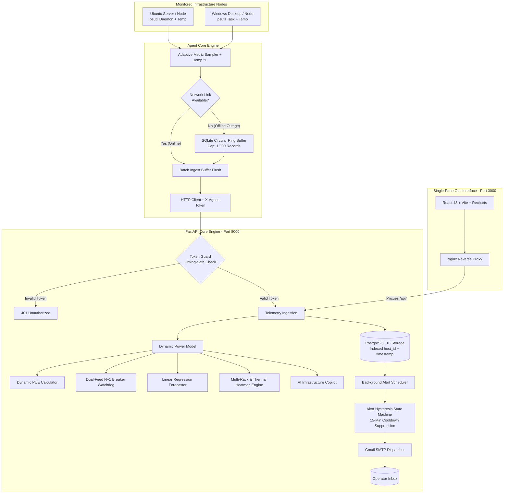

# ⚡ คู่มือการใช้งานระบบ InfraPulse (InfraPulse User & Operations Manual)
**ระบบมอนิเตอร์โครงสร้างพื้นฐานและบริหารจัดการความจุดาต้าเซ็นเตอร์ขนาดเล็ก (Mini Data Center Infrastructure & Capacity Management Platform - DCIM)**

---

## 🎯 1. จุดประสงค์ของโครงการ (Objectives & Purpose)

### 📌 ปัญหาที่พบในชีวิตจริง (The Real-World Problem)
ในห้อง Server Room หรือ Edge Data Center ขององค์กร, โรงงานอุตสาหกรรม, โรงพยาบาล หรือสาขาย่อย (ที่มีเซิร์ฟเวอร์ประมาณ 5–50 เครื่อง และอุปกรณ์เครือข่าย):
1. **ซอฟต์แวร์ DCIM ระดับองค์กรมีราคาสูงเกินไป:** ซอฟต์แวร์อย่าง Schneider EcoStruxure, Sunbird หรือ Nlyte มีค่าลิขสิทธิ์หลักล้านบาท และต้องซื้อเซนเซอร์ไฟฟ้าเฉพาะทาง
2. **เครื่องมือมอนิเตอร์ทั่วไปมองไม่เห็นมิติด้านไฟฟ้าและความร้อน:** ซอฟต์แวร์ Sysadmin ทั่วไปอย่าง Prometheus, Grafana หรือ Netdata มอนิเตอร์ได้เฉพาะ CPU/RAM/Disk แต่ **ไม่รู้ว่าไฟตู้แร็คใกล้เต็มเบรกเกอร์หรือยัง ไม่รู้ประสิทธิภาพพลังงาน (PUE) และไม่มีผังความร้อนของตู้แร็ค (Thermal Heatmap)**
3. **ความเสี่ยงเบรกเกอร์ทริปจากการขยายระบบ:** เมื่อซื้อเซิร์ฟเวอร์มาเพิ่ม หากเสียบปลั๊กโดยไม่รู้ความจุไฟฟ้าจริง อาจทำให้เบรกเกอร์หลักตัด และระบบไอทีล่มทั้งบริษัท
4. **ความไม่แน่นอนของระบบไฟสำรอง (N+1 Failover):** มีรางไฟ 2 สาย (Feed A / Feed B) แต่ไม่เคยทดสอบคำนวณจริงว่าถ้า Feed ใด Feed หนึ่งดับกะทันหัน อีกฝั่งจะรับโหลดไหวไหม หรือจะตัดตามไปอีกตัว

### 💡 เป้าหมายของ InfraPulse
* **ผสาน IT Telemetry เข้ากับ DCIM:** รวมการเก็บข้อมูลเครื่องลูกข่ายเข้ากับการคำนวณฟิสิกส์ไฟฟ้าและความร้อนในแพลตฟอร์มเดียว
* **สอดคล้องกับมาตรฐานอุตสาหกรรม Data Center ไทย:** รองรับเกณฑ์ชี้วัด PUE ($\le 1.30$) ตามมาตรฐานส่งเสริมการลงทุน **BOI Data Center**
* **ยึดตามมาตรฐานความปลอดภัยไฟฟ้าสากล:** ใช้เกณฑ์ **NEC 80% Continuous Load Derate** ในการประเมินโหลดเบรกเกอร์
* **Zero-Licensing Cost:** ทำงานบน Open-Source Stack (FastAPI + PostgreSQL 16 + React TypeScript + Docker) ที่นำไปติดตั้งใช้งานได้ฟรีทันที
* **AI Infrastructure Copilot:** มีระบบ AI วิเคราะห์สุขภาพห้องดาต้าเซ็นเตอร์ (DCIM Health Score 0-100) และให้คำแนะนำเชิงวิศวกรรมอัตโนมัติ

---

## ⚙️ 2. สถาปัตยกรรมและหลักการทำงานของระบบ (How It Works)

InfraPulse ประกอบด้วยโมดูลวิศวกรรมหลักที่ทำงานร่วมกันแบบ Real-Time:



---

## 🚀 3. ขั้นตอนการติดตั้งและเริ่มใช้งาน (Quickstart Guide)

### 🖥️ ขั้นตอนที่ 1: ติดตั้ง Client Agent บนเครื่องแม่ข่าย/ลูกข่าย (1 คำสั่งจบ)

#### บนระบบปฏิบัติการ Windows (รันผ่าน PowerShell):
เปิด PowerShell แล้ววางคำสั่ง 1 บรรทัดนี้:
```powershell
irm https://raw.githubusercontent.com/Disorn1998/infrapulse/main/agent/install.ps1 | iex
```

#### บนระบบปฏิบัติการ Linux / Ubuntu:
เปิด Terminal แล้ววางคำสั่ง 1 บรรทัดนี้:
```bash
curl -sSL https://raw.githubusercontent.com/Disorn1998/infrapulse/main/agent/install.sh | sudo bash
```

---

## 🖥️ 4. วิธีการอ่านค่าและการใช้งาน Dashboard (How to Read & Use)

ระบบถูกออกแบบมาให้แสดงผลเป็น 3 แท็บหลัก เพื่อครอบคลุมทั้งมิติทางด้านซอฟต์แวร์ (IT) และมิติทางด้านฮาร์ดแวร์/ไฟฟ้า (Facility)

### 📊 แท็บ 1: Real-Time Telemetry (สถานะเซิร์ฟเวอร์แบบเรียลไทม์)
หน้าต่างนี้ใช้สำหรับตรวจสอบสุขภาพของเซิร์ฟเวอร์แต่ละตัว (Node) แบบวินาทีต่อวินาที
* **วิธีอ่านค่า Status:** เซิร์ฟเวอร์ที่ทำงานปกติจะขึ้น `🟢 Online` หากเน็ตหลุดหรือเครื่องดับจะเปลี่ยนเป็น `🔴 Offline`
* **วิธีอ่านค่าความร้อน (Thermal Badge):** บนการ์ดเซิร์ฟเวอร์จะมีตัวเลข **🌡️ XX.X°C**
  * 🟦 **สีฟ้า (< 45°C):** เครื่องเย็นมาก (Idle)
  * 🟩 **สีเขียว (45-65°C):** อุณหภูมิทำงานปกติ (Optimal)
  * 🟧 **สีส้ม (65-75°C):** อุณหภูมิค่อนข้างสูง ควรเริ่มจับตาดู
  * 🟥 **สีแดง (> 75°C):** ร้อนเกินเกณฑ์ (Hotspot) เสี่ยงต่อการถูกลดความเร็ว (CPU Throttling)
* **กราฟ Network (RX/TX):** เส้นสีเขียวคือข้อมูลที่รับเข้า (Download) เส้นสีส้มคือข้อมูลที่ส่งออก (Upload)

### ⚡ แท็บ 2: Capacity & Power Intelligence (การบริหารจัดการระบบไฟฟ้าและพื้นที่)
หน้าต่างนี้คือ **"หัวใจหลักของการเป็น DCIM"** ใช้ดูภาพรวมของทั้งห้อง Data Center
* **วิธีอ่านค่า Dynamic PUE Index (ด้านบนสุด):**
  * **PUE (Power Usage Effectiveness)** คือตัววัดความคุ้มค่าของการใช้ไฟ ยิ่งใกล้ `1.0` ยิ่งดี
  * มาตรฐานที่ **BOI (บีโอไอ)** กำหนดให้สิทธิประโยชน์คือ **$\le 1.30$**
  * *ข้อควรรู้:* ในช่วงที่เซิร์ฟเวอร์รันงานน้อย (Idle) ค่า PUE จะเด้งสูงขึ้น เพราะแอร์และระบบไฟพื้นฐาน (Fixed Overhead) ยังคงกินไฟเท่าเดิมถือเป็นเรื่องปกติ
* **วิธีอ่านค่า N+1 Power Redundancy:**
  * **HEALTHY:** หมายความว่าหากไฟตก 1 สาย (เช่น Feed A ดับ) สายไฟ Feed B ที่เหลืออยู่สามารถรับโหลดทั้งหมดของห้องได้โดยที่ **เบรกเกอร์ไม่ทริป** (ปลอดภัยตามกฎ NEC 80% Continuous Load)
* **วิธีอ่านกราฟ Predictive Power Growth (พยากรณ์ไฟเต็ม):**
  * กราฟจะพล็อตเส้นทแยงมุมเพื่อดูว่า "การใช้ไฟฟ้าของคุณโตขึ้นกี่ Watt ต่อวัน"
  * **Days to Exhaustion:** AI จะคำนวณวันให้เลยว่า อีกกี่วันไฟจะเต็ม 100% (ช่วยให้คุณทำเรื่องขอเบิกงบขยายเฟสใหม่ได้ทันเวลา)
* **วิธีใช้งาน Multi-Rack Thermal Heatmap:**
  * กดปุ่มเลือกตู้แร็ค **`Rack-01`**, **`Rack-02`**, หรือ **`Rack-03`** เพื่อดูผังจำลอง
  * ดูแถบสีช่อง U (U1 - U42) เพื่อตรวจสอบว่ามีเซิร์ฟเวอร์ติดตั้งอยู่ที่ช่องไหนบ้าง อาศัยไฟจาก Feed ไหน (A หรือ B) และมีความร้อนสะสมในช่องนั้นเท่าไหร่ 
* **วิธีบันทึก Historical Monthly Audit:**
  * กดปุ่ม **"+ Add Monthly Audit"** เพื่อกรอกบิลค่าไฟรายเดือน (หน่วย kWh) 
  * ระบบจะนำมาคำนวณ PUE รายเดือนเก็บเป็นประวัติระยะยาว สำหรับใช้ยื่นขอมาตรฐาน ISO หรือ BOI

### 🤖 แท็บ 3: AI Infrastructure Copilot (ผู้ช่วยวิเคราะห์ศูนย์ข้อมูล)
ไม่ต้องตีความกราฟเอง ปล่อยให้ AI วิเคราะห์และสรุปให้!
* **DCIM Health Score:** คะแนนสุขภาพรวมของห้อง Server (เต็ม 100)
* **วิธีอ่าน Smart Insight Cards:**
  * ระบบจะออกการ์ดแจ้งเตือน (CRITICAL, WARNING, INFO) ตามข้อมูลจริงที่เกิดขึ้น
  * เช่น หากเสียบปลั๊กเซิร์ฟเวอร์เทไปที่ Feed A มากเกินไป AI จะบอกว่า *"A/B Dual-Feed Power Imbalance Detected"* พร้อมบอกให้ย้ายปลั๊กเพื่อรักษาสมดุล 50/50

### ⚙️ แถบเมนูด้านบน (Header Controls)
* **ปุ่ม ⚙️ Alert Rules:** ใช้สำหรับตั้งค่า "ขีดจำกัดแจ้งเตือน (Threshold)" แบบสไลด์บาร์ เมื่อ CPU, RAM, Disk หรือความร้อน ทะลุเกณฑ์ที่ตั้งไว้ ระบบจะส่ง Email แจ้งเตือนทันที (พร้อมระบบหน่วงเวลา 15 นาทีกันแจ้งเตือนสแปม)
* **ปุ่ม 📑 Export Audit:** กดเพื่อดาวน์โหลดข้อมูลดิบของเซิร์ฟเวอร์ทั้งหมด, ค่าการกินไฟ, และประวัติ Audit แบบไฟล์ **.CSV** ออกไปเปิดใน Excel ทันที

---

## 🌐 5. ช่องทางการเข้าชมระบบออนไลน์ 24/7

* **🚀 24/7 Cloud Production Dashboard:** [https://infrapulse-0ft2.onrender.com/](https://infrapulse-0ft2.onrender.com/)
* **🌐 Cloudflare Tunnel Live Demo:** [https://membership-guarantee-forgotten-div.trycloudflare.com](https://membership-guarantee-forgotten-div.trycloudflare.com/)
* **📚 Interactive OpenAPI/Swagger Docs:** [https://infrapulse-backend-fddp.onrender.com/docs](https://infrapulse-backend-fddp.onrender.com/docs)
