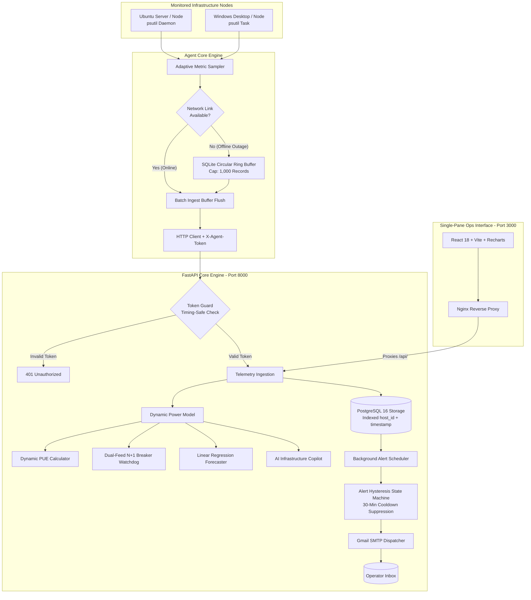

# ⚡ คู่มือการใช้งานระบบ InfraPulse (InfraPulse User & Operations Manual)
**ระบบมอนิเตอร์โครงสร้างพื้นฐานและบริหารจัดการความจุดาต้าเซ็นเตอร์ขนาดเล็ก (Mini Data Center Infrastructure & Capacity Management Platform - DCIM)**

---

## 🎯 1. จุดประสงค์ของโครงการ (Objectives & Purpose)

### 📌 ปัญหาที่พบในชีวิตจริง (The Real-World Problem)
ในห้อง Server Room หรือ Edge Data Center ขององค์กร, โรงงานอุตสาหกรรม, โรงพยาบาล หรือสาขาย่อย (ที่มีเซิร์ฟเวอร์ประมาณ 5–50 เครื่อง และอุปกรณ์เครือข่าย):
1. **ซอฟต์แวร์ DCIM ระดับองค์กรมีราคาสูงเกินไป:** ซอฟต์แวร์อย่าง Schneider EcoStruxure, Sunbird หรือ Nlyte มีค่าลิขสิทธิ์หลักล้านบาท และต้องซื้อเซนเซอร์ไฟฟ้าเฉพาะทาง
2. **เครื่องมือมอนิเตอร์ทั่วไปมองไม่เห็นมิติด้านไฟฟ้า:** ซอฟต์แวร์ Sysadmin ทั่วไปอย่าง Prometheus, Grafana หรือ Netdata มอนิเตอร์ได้เฉพาะ CPU/RAM/Disk แต่ **ไม่รู้ว่าไฟตู้แร็คใกล้เต็มเบรกเกอร์หรือยัง และไม่รู้ประสิทธิภาพพลังงาน (PUE)**
3. **ความเสี่ยงเบรกเกอร์ทริปจากการขยายระบบ:** เมื่อซื้อเซิร์ฟเวอร์มาเพิ่ม หากเสียบปลั๊กโดยไม่รู้ความจุไฟฟ้าจริง อาจทำให้เบรกเกอร์หลักตัด และระบบไอทีล่มทั้งบริษัท
4. **ความไม่แน่นอนของระบบไฟสำรอง (N+1 Failover):** มีรางไฟ 2 สาย (Feed A / Feed B) แต่ไม่เคยทดสอบคำนวณจริงว่าถ้า Feed ใด Feed หนึ่งดับกะทันหัน อีกฝั่งจะรับโหลดไหวไหม หรือจะตัดตามไปอีกตัว

### 💡 เป้าหมายของ InfraPulse
* **ผสาน IT Telemetry เข้ากับ DCIM:** รวมการเก็บข้อมูลเครื่องลูกข่ายเข้ากับการคำนวณฟิสิกส์ไฟฟ้าในแพลตฟอร์มเดียว
* **สอดคล้องกับมาตรฐานอุตสาหกรรม Data Center ไทย:** รองรับเกณฑ์ชี้วัด PUE ($\le 1.30$) ตามมาตรฐานส่งเสริมการลงทุน **BOI Data Center**
* **ยึดตามมาตรฐานความปลอดภัยไฟฟ้าสากล:** ใช้เกณฑ์ **NEC 80% Continuous Load Derate** ในการประเมินโหลดเบรกเกอร์
* **Zero-Licensing Cost:** ทำงานบน Open-Source Stack (FastAPI + PostgreSQL 16 + React TypeScript + Docker) ที่นำไปติดตั้งใช้งานได้ฟรีทันที
* **AI Infrastructure Copilot:** มีระบบ AI วิเคราะห์สุขภาพห้องดาต้าเซ็นเตอร์ (DCIM Health Score 0-100) และให้คำแนะนำเชิงวิศวกรรมอัตโนมัติ

---

## ⚙️ 2. สถาปัตยกรรมและหลักการทำงานของระบบ (How It Works)

InfraPulse ประกอบด้วย 6 โมดูลวิศวกรรมหลักที่ทำงานร่วมกันแบบ Real-Time:



---

### 🔬 รายละเอียด 6 กลไกการคำนวณหลัก

#### 1. การประมาณกำลังไฟฟ้าเซิร์ฟเวอร์แบบแปรผันตามโหลด (Dynamic Server Power)
คำนวณกำลังไฟฟ้า (Watts) ของแต่ละเครื่องจากโหลด CPU จริง:
$$P_{\text{node}}(t) = P_{\text{idle}} + \left( \frac{\text{CPU Usage \%}(t)}{100} \times (P_{\text{rated}} - P_{\text{idle}}) \right)$$
* *ตัวอย่าง:* เครื่องเซิร์ฟเวอร์ ($P_{\text{idle}}=25\text{W}, P_{\text{rated}}=120\text{W}$) รัน CPU 50% $\rightarrow$ ใช้ไฟ $25 + 0.5 \times (120 - 25) = 72.5\text{ Watts}$

#### 2. ดัชนีประสิทธิภาพพลังงานแปรผันตามโหลด (Dynamic PUE with Fixed Overhead)
ในดาต้าเซ็นเตอร์จริง อุปกรณ์อย่างพัดลมแอร์ CRAC, ไฟส่องสว่าง และ UPS จะมีค่าไฟพื้นฐาน ($P_{\text{fixed}} = 35\text{W}$) ที่กินไฟตลอดเวลาแม้เซิร์ฟเวอร์จะว่างงาน:
$$P_{\text{Facility}}(t) = P_{\text{IT}}(t) + k_c P_{\text{IT}}(t) + \lambda_{\text{pdu}} P_{\text{IT}}(t) + P_{\text{fixed}}$$
$$\text{PUE}(t) = \frac{P_{\text{Facility}}(t)}{P_{\text{IT}}(t)} = 1 + k_c + \lambda_{\text{pdu}} + \frac{P_{\text{fixed}}}{P_{\text{IT}}(t)}$$
* *หลักฟิสิกส์:* เมื่อโหลดเซิร์ฟเวอร์เพิ่มขึ้น ค่า $P_{\text{fixed}}$ จะถูกเจือจาง ทำให้ค่า PUE ปรับตัวลดลงจาก $1.65 \rightarrow 1.19$ (ยิ่งประหยัดพลังงานขึ้น สอดคล้องกับเกณฑ์ BOI $\le 1.30$)

#### 3. การประเมินความปลอดภัยไฟฟ้าสำรอง (Dual-Feed N+1 Redundancy)
ระบบจำลองกรณี Feed A ดับ และตรวจสอบว่า Feed B ฝั่งเดียว (หลังคูณเกณฑ์ความปลอดภัย **NEC 80% Continuous Derate** $= 3,680\text{W} \times 0.800 = 2,944\text{W}$) จะรับโหลดรวมทั้งหมดไหวหรือไม่
* $\sum P_{\text{IT}} \le 2,944\text{W} \rightarrow$ **`HEALTHY`** (ปลอดภัย 100%)
* $\sum P_{\text{IT}} > 2,944\text{W} \rightarrow$ **`NON_COMPLIANT`** (เสี่ยงเบรกเกอร์ทริป ต้องเกลี่ยโหลดด่วน)

#### 4. การพยากรณ์ความจุล่วงหน้าด้วย Linear Regression ($y = mx + c$)
วิเคราะห์แนวโน้มการเติบโตของการใช้ไฟจากข้อมูล Time-Series ย้อนหลัง เพื่อหาความชัน $m$ (Watts/Day) และคำนวณหาวันที่ความจุเบรกเกอร์จะเต็ม 100%:
$$\text{Days to Exhaustion} = \frac{\text{Total Capacity (10,000 W)} - \text{Current Load}}{\text{Growth Slope (Watts/Day)}}$$

#### 5. ระบบสเตตแมชชีนแจ้งเตือนและระบบกันสแปม (Hysteresis Alerting & Cooldown)
* เปลี่ยนสถานะตามลำดับ: `OK` $\rightarrow$ `PENDING` $\rightarrow$ `FIRING` $\rightarrow$ `RESOLVED`
* มีระบบ **Cooldown 30 นาที** ระงับการส่งอีเมลซ้ำซ้อนขณะที่ปัญหายังไม่คลี่คลาย
* ส่งอีเมลแจ้งเตือนปิดเคส **`[RESOLVED]`** อัตโนมัติทันทีที่ค่ากลับมาเป็นปกติ

#### 6. ระบบ AI Infrastructure Copilot & DCIM Health Scoring
* ประเมินคะแนน **DCIM Health Score (0-100)** แบบ Real-Time
* ตรวจจับความไม่สมดุลของกระแสไฟฟ้าระหว่าง Feed A และ Feed B (Imbalance Detection)
* ให้คำแนะนำเชิงปฏิบัติการ (Actionable Recommendation Cards) เช่น การเกลี่ยโหลด, การปรับมุมแอร์, หรือการเตรียมจัดซื้อ PDU ล่วงหน้า

---

## 📖 3. คู่มือขั้นตอนการติดตั้งและใช้งานจริง (Step-by-Step Guide)

### 🚀 ขั้นตอนที่ 1: เปิดระบบศูนย์กลาง (Central Stack)
1. ติดตั้ง Docker Desktop บนเครื่องเซิร์ฟเวอร์หลัก
2. เปิด Terminal ในโฟลเดอร์โปรเจกต์:
   ```bash
   cd infrapulse
   cp .env.example .env
   docker compose up -d --build
   ```
3. เปิดเบราว์เซอร์ไปที่: **`http://localhost:3000`**

---

### 💻 ขั้นตอนที่ 2: ติดตั้ง Agent บนเครื่องที่ต้องการมอนิเตอร์

#### บนระบบปฏิบัติการ Ubuntu / Linux (รันเป็น systemd Service 24/7):
```bash
cd infrapulse/agent
pip install -r requirements.txt
sudo bash deploy/install_ubuntu_service.sh
```

#### บนระบบปฏิบัติการ Windows (รันเป็น Background Task):
```powershell
cd infrapulse\agent
pip install -r requirements.txt
powershell -ExecutionPolicy Bypass -File deploy\install_windows_task.ps1
```

---

### 🖥️ ขั้นตอนที่ 3: การใช้งานหน้าจอ Dashboard (3 แท็บหลัก)

#### 1. แถบเครื่องมือ `🎮 Interactive Demo Sandbox` (ด้านบนสุด):
* **ปุ่ม `🚀 Simulate Cluster`:** กดคลิกเดียวเพื่อจำลองเซิร์ฟเวอร์ 4 เครื่อง (Proxy, DB, AI, Storage) ลงตู้แร็ค 42U
* **ปุ่ม `⚡ Spike Load (PUE Curve)`:** กดคลิกเดียวเพื่อจำลองโหลดพุ่ง 92% ดูค่า PUE ลดลงสดๆ
* **ปุ่ม `🔌 Feed A Outage`:** กดคลิกเดียวเพื่อจำลองไฟดับ Feed A ตรวจสอบระบบ Failover

#### 2. แท็บ `🖥️ Real-Time Telemetry`:
* **Node Cards:** ดูสถานะ Online/Offline (กะพริบสีเขียวเมื่อมี Heartbeat ภายใน 90 วินาที)
* **Metric Gauges:** ดูโหลด CPU %, RAM %, และ Disk %
* **Dual-Stream Network Chart:** กราฟเส้นแยกข้อมูลรับเข้า (`RX Received` - สีเขียว) และข้อมูลส่งออก (`TX Transmitted` - สีส้ม)

#### 3. แท็บ `⚡ Capacity & Power Intelligence`:
* **Facility Capacity Gauge:** ดู % การใช้ไฟฟ้าเทียบกับขีดจำกัดเบรกเกอร์ (10,000 W)
* **Capacity Runout Forecast:** ดูกราฟพยากรณ์และวันที่คาดว่าไฟจะเต็ม 100%
* **42U Rack Elevation View:** ดูผังตู้แร็คจำลองตำแหน่งเซิร์ฟเวอร์แต่ละตัว (U1–U42) พร้อมรางไฟ Feed A/B
* **Historical Monthly Audit Logs:** ดูกราฟเปรียบเทียบบิลค่าไฟย้อนหลัง และกดปุ่ม **"+ Add Monthly Audit"** เพื่อบันทึกข้อมูลค่าไฟรายเดือนจริง

#### 4. แท็บ `🤖 AI Infrastructure Copilot`:
* **DCIM Health Index:** ดูคะแนนสุขภาพรวมของห้องดาต้าเซ็นเตอร์ (0–100)
* **Executive Summary:** บทวิเคราะห์สรุปสำหรับผู้บริหาร
* **Smart Insight Cards:** การ์ดคำแนะนำและข้อเสนอแนะเชิงวิศวกรรมพลังงานและความปลอดภัยไฟฟ้า

---

### 📧 ขั้นตอนที่ 4: การตั้งค่ารับอีเมลแจ้งเตือนจริง (Gmail SMTP)
ในไฟล์ [`.env`](file:///c:/Users/msi/Desktop/disorn/project/infrapulse/.env) ใส่ข้อมูล Gmail App Password (16 หลัก):
```env
SMTP_HOST=smtp.gmail.com
SMTP_PORT=587
SMTP_USER=your_email@gmail.com
SMTP_PASSWORD=your_16_character_app_password
SMTP_FROM_EMAIL=your_email@gmail.com
DEFAULT_ALERT_RECIPIENT=your_email@gmail.com
```
*ทดสอบยิงอีเมล:*
```bash
curl -X POST "http://localhost:8000/api/v1/alerts/test?recipient_email=your_email@gmail.com"
```

---

### 🌐 ขั้นตอนที่ 5: การแชร์ Live Demo Link ผ่าน Cloudflare Tunnel (ฟรี)
เปิดให้กรรมการหรือเพื่อนร่วมงานเข้าดู Dashboard จากนอกบ้านได้ทันที:
```powershell
cd infrapulse
.\cloudflared.exe tunnel --url http://localhost:3000
```
คัดลอกลิงก์ HTTPS ที่ได้ (เช่น `https://xxx.trycloudflare.com`) ไปเปิดบนสมาร์ตโฟนหรือแชร์ได้ทันที 100% ครับ!
